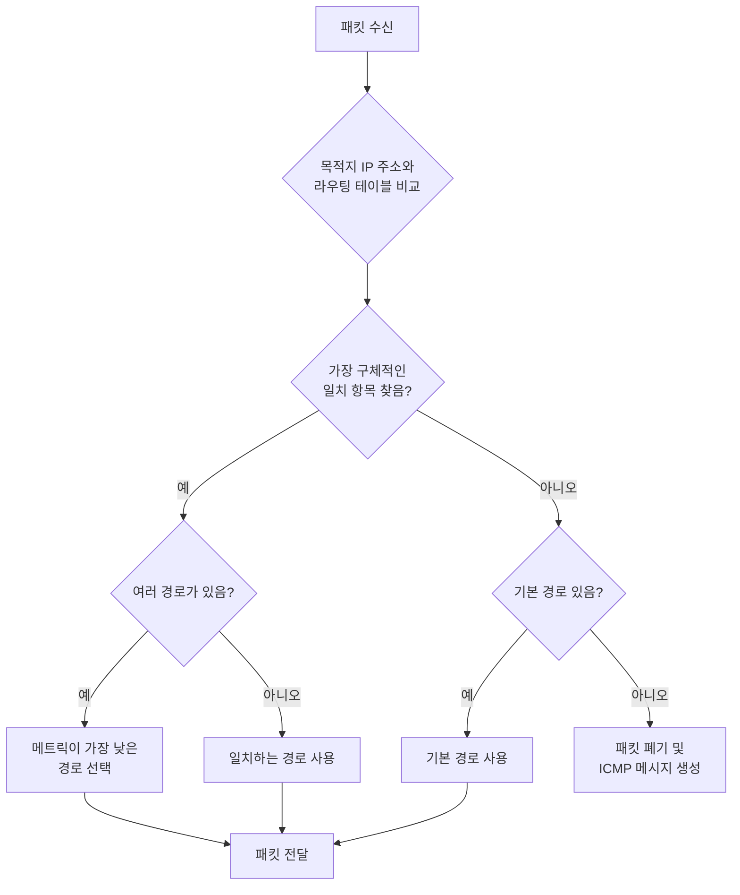
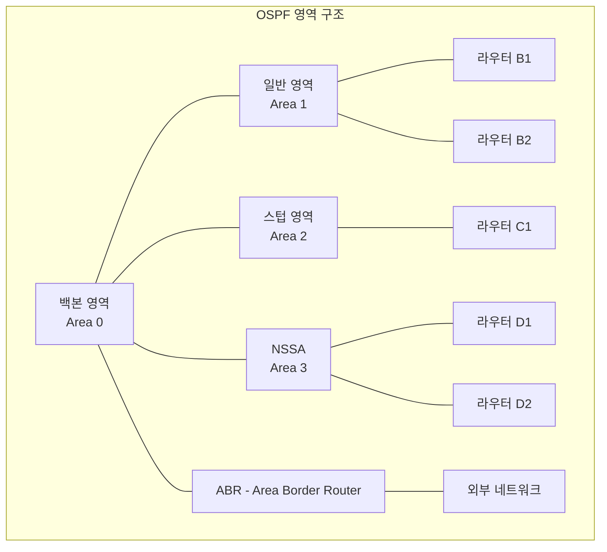

# Chapter 03 네트워크 계층

## 03-3 라우팅

### 개요
이 섹션에서는 네트워크 계층의 핵심 기능인 라우팅에 대해 살펴봅니다. 라우터의 구조와 역할, 라우팅 테이블의 구성과 동작 원리, 정적 라우팅과 동적 라우팅의 차이점, 그리고 주요 라우팅 프로토콜(RIP, OSPF, BGP)의 특징과 작동 방식에 대해 학습합니다. 이를 통해 인터넷과 같은 대규모 네트워크에서 데이터가 어떻게 목적지까지 효율적으로 전달되는지 이해하고, 네트워크 설계 및 문제 해결에 필요한 지식을 습득합니다.

### 라우터

라우터(Router)는 네트워크 계층(OSI 모델의 3계층)에서 동작하는 네트워크 장비로, 서로 다른 네트워크 간의 데이터 패킷 전달을 담당합니다. 라우터는 네트워크 간의 최적 경로를 결정하고, 해당 경로를 통해 패킷을 전달하는 역할을 합니다.

#### 라우터의 구조

라우터는 일반적으로 다음과 같은 구성 요소로 이루어져 있습니다:

1. **CPU**: 라우팅 알고리즘을 실행하고 라우팅 테이블을 관리합니다.
2. **메모리**:
   - **RAM**: 라우팅 테이블, 패킷 버퍼, 실행 중인 구성 등을 저장합니다.
   - **NVRAM(Non-Volatile RAM)**: 시작 구성 파일을 저장합니다.
   - **플래시 메모리**: 라우터 운영 체제(IOS 등)를 저장합니다.
3. **인터페이스**: 다양한 네트워크에 연결하기 위한 물리적 포트(이더넷, 시리얼, 광 등)를 제공합니다.
4. **시스템 버스**: 내부 구성 요소 간의 데이터 전송을 위한 통로입니다.

#### 라우터의 기능

라우터의 주요 기능은 다음과 같습니다:

1. **패킷 전달(Packet Forwarding)**: 수신된 패킷을 적절한 출력 인터페이스로 전달합니다.
2. **경로 결정(Path Determination)**: 목적지 네트워크까지의 최적 경로를 결정합니다.
3. **라우팅 테이블 관리**: 네트워크 토폴로지 정보를 저장하고 업데이트합니다.
4. **네트워크 분리**: 브로드캐스트 도메인을 분리하여 네트워크 트래픽을 제한합니다.
5. **프로토콜 변환**: 서로 다른 네트워크 프로토콜 간의 변환을 지원할 수 있습니다.
6. **패킷 필터링**: 기본적인 방화벽 기능을 제공하여 특정 트래픽을 차단할 수 있습니다.

#### 라우터의 동작 과정

라우터의 기본적인 동작 과정은 다음과 같습니다:

1. **패킷 수신**: 인터페이스를 통해 패킷을 수신합니다.
2. **헤더 검사**: IP 헤더를 검사하여 목적지 IP 주소를 확인합니다.
3. **라우팅 테이블 조회**: 목적지 IP 주소에 해당하는 최적 경로를 라우팅 테이블에서 찾습니다.
4. **TTL 감소**: IP 패킷의 TTL(Time To Live) 값을 1 감소시킵니다.
5. **체크섬 재계산**: IP 헤더가 변경되었으므로 체크섬을 재계산합니다.
6. **패킷 전달**: 결정된 경로에 따라 적절한 출력 인터페이스로 패킷을 전달합니다.


### 라우팅 테이블

라우팅 테이블(Routing Table)은 라우터가 패킷을 전달하기 위해 사용하는 데이터베이스로, 목적지 네트워크와 해당 네트워크로 가는 경로 정보를 저장합니다.

#### 라우팅 테이블의 구성 요소

일반적인 라우팅 테이블은 다음과 같은 정보를 포함합니다:

1. **목적지 네트워크/호스트**: 패킷이 전달될 목적지 네트워크 또는 호스트의 IP 주소와 서브넷 마스크(또는 CIDR 표기법)
2. **넥스트 홉(Next Hop)**: 패킷이 목적지로 가기 위해 다음으로 전달되어야 할 라우터의 IP 주소
3. **출력 인터페이스**: 패킷이 전송될 라우터의 물리적 인터페이스
4. **메트릭(Metric)**: 경로의 선호도를 나타내는 값으로, 홉 수, 대역폭, 지연 시간 등 다양한 요소에 기반할 수 있음
5. **경로 소스**: 해당 경로 정보의 출처(직접 연결, 정적 구성, 특정 라우팅 프로토콜 등)
6. **경로 유효 시간**: 동적 라우팅 프로토콜에서 경로 정보가 유효한 시간

#### 라우팅 테이블 예시

| 목적지 네트워크       | 넥스트 홉         | 인터페이스     | 메트릭 | 소스    |
|----------------|---------------|-----------|-----|-------|
| 192.168.1.0/24 | 직접 연결         | Ethernet0 | 0   | 직접 연결 |
| 192.168.2.0/24 | 192.168.1.2   | Ethernet0 | 1   | RIP   |
| 10.0.0.0/8     | 192.168.1.254 | Ethernet0 | 2   | OSPF  |
| 0.0.0.0/0      | 192.168.1.254 | Ethernet0 | 1   | 정적    |

위 예시에서:
- 192.168.1.0/24 네트워크는 라우터에 직접 연결되어 있습니다.
- 192.168.2.0/24 네트워크로 가기 위해서는 192.168.1.2로 패킷을 전송해야 합니다.
- 10.0.0.0/8 네트워크로 가기 위해서는 192.168.1.254로 패킷을 전송해야 합니다.
- 0.0.0.0/0은 기본 경로(default route)로, 다른 경로가 없는 모든 목적지에 대해 192.168.1.254로 패킷을 전송합니다.

#### 라우팅 테이블 조회 과정

라우터가 패킷을 수신하면 다음과 같은 과정으로 라우팅 테이블을 조회합니다:

1. 목적지 IP 주소와 라우팅 테이블의 각 항목을 비교합니다.
2. 가장 구체적인 일치(Longest Prefix Match)를 찾습니다. 즉, 일치하는 비트 수가 가장 많은 항목을 선택합니다.
3. 일치하는 항목이 여러 개인 경우, 메트릭 값이 가장 낮은 경로를 선택합니다.
4. 일치하는 항목이 없으면 기본 경로(0.0.0.0/0)를 사용합니다.
5. 기본 경로도 없으면 패킷을 폐기하고 "목적지에 연결할 수 없음(Destination Unreachable)" ICMP 메시지를 생성합니다.



### 정적 라우팅과 동적 라우팅

라우팅 정보를 얻는 방법에 따라 정적 라우팅과 동적 라우팅으로 구분할 수 있습니다.

#### 정적 라우팅

정적 라우팅(Static Routing)은 네트워크 관리자가 수동으로 라우팅 테이블을 구성하는 방식입니다.

**특징**:
- 관리자가 직접 경로를 설정하고 유지 관리
- 네트워크 토폴로지가 변경되면 수동으로 업데이트 필요
- 라우팅 프로토콜 오버헤드가 없어 네트워크 리소스 절약
- 경로가 명확하게 예측 가능
- 보안성이 높음 (라우팅 정보가 공유되지 않음)

**적합한 환경**:
- 소규모 네트워크
- 토폴로지 변경이 거의 없는 안정적인 네트워크
- 단일 출구 지점(예: 인터넷으로의 기본 경로)
- 보안이 중요한 환경

**단점**:
- 대규모 네트워크에서 관리 부담이 큼
- 네트워크 변경 시 수동 업데이트 필요
- 링크 장애 시 자동 대체 경로 설정 불가

**정적 라우팅 구성 예시** (Cisco IOS):
```
Router(config)# ip route 192.168.2.0 255.255.255.0 192.168.1.2
```
위 명령은 목적지 네트워크 192.168.2.0/24로 가는 경로를 넥스트 홉 192.168.1.2로 설정합니다.

#### 동적 라우팅

동적 라우팅(Dynamic Routing)은 라우팅 프로토콜을 사용하여 라우터 간에 라우팅 정보를 자동으로 교환하고 최적 경로를 계산하는 방식입니다.

**특징**:
- 라우터가 자동으로 라우팅 정보를 교환하고 업데이트
- 네트워크 변화에 자동으로 적응
- 장애 발생 시 대체 경로를 자동으로 찾음
- 라우팅 프로토콜 오버헤드 발생 (CPU, 메모리, 대역폭 사용)
- 라우팅 알고리즘에 따라 최적 경로 계산

**적합한 환경**:
- 중대형 네트워크
- 복잡한 토폴로지
- 여러 경로가 존재하는 네트워크
- 네트워크 변경이 자주 발생하는 환경

**단점**:
- 라우팅 프로토콜 오버헤드 발생
- 초기 설정이 복잡할 수 있음
- 보안 위험 가능성 (라우팅 정보가 공유됨)
- 경로 선택이 항상 관리자의 의도와 일치하지 않을 수 있음

**동적 라우팅 구성 예시** (Cisco IOS에서 RIP 구성):
```
Router(config)# router rip
Router(config-router)# network 192.168.1.0
Router(config-router)# network 192.168.2.0
```
위 명령은 RIP 라우팅 프로토콜을 활성화하고, 192.168.1.0과 192.168.2.0 네트워크에 대한 라우팅 정보를 교환하도록 설정합니다.

#### 정적 라우팅과 동적 라우팅 비교

| 특성 | 정적 라우팅 | 동적 라우팅 |
|------|------------|------------|
| 구성 방식 | 수동 | 자동 |
| 관리 부담 | 소규모 네트워크에서 낮음, 대규모 네트워크에서 높음 | 초기 설정 후 낮음 |
| 네트워크 변화 대응 | 수동 업데이트 필요 | 자동 적응 |
| 리소스 사용 | 낮음 | 높음 (CPU, 메모리, 대역폭) |
| 확장성 | 제한적 | 우수함 |
| 보안성 | 높음 | 상대적으로 낮음 |
| 장애 대응 | 제한적 | 자동 대체 경로 찾음 |
| 적합한 환경 | 소규모, 안정적인 네트워크 | 중대형, 복잡한 네트워크 |

실제 네트워크에서는 정적 라우팅과 동적 라우팅을 함께 사용하는 경우가 많습니다. 예를 들어, 인터넷으로의 기본 경로는 정적으로 설정하고, 내부 네트워크 간의 라우팅은 동적 라우팅 프로토콜을 사용하는 방식입니다.

### 라우팅 프로토콜

라우팅 프로토콜은 라우터 간에 라우팅 정보를 교환하고 최적 경로를 결정하는 규칙과 메커니즘을 정의합니다. 라우팅 프로토콜은 크게 내부 게이트웨이 프로토콜(IGP)과 외부 게이트웨이 프로토콜(EGP)로 구분됩니다.

#### IGP: RIP와 OSPF

내부 게이트웨이 프로토콜(IGP, Interior Gateway Protocol)은 동일한 자율 시스템(AS, Autonomous System) 내에서 라우팅 정보를 교환하는 데 사용됩니다. 자율 시스템은 동일한 관리 도메인 하에 있는 네트워크 집합을 의미합니다.

##### RIP (Routing Information Protocol)

RIP는 가장 오래된 라우팅 프로토콜 중 하나로, 거리 벡터(Distance Vector) 알고리즘을 사용합니다.

**특징**:
- 홉 수(hop count)를 메트릭으로 사용
- 최대 홉 수 제한: 15 (16은 도달 불가능으로 간주)
- 주기적으로 전체 라우팅 테이블 교환 (기본 30초마다)
- 간단한 구현과 설정
- 소규모 네트워크에 적합

**장점**:
- 구현과 설정이 간단
- 적은 리소스 요구
- 다양한 장비에서 지원

**단점**:
- 홉 수만 고려하여 대역폭, 지연 등 다른 요소 무시
- 수렴 속도가 느림 (카운트-투-인피니티 문제)
- 주기적인 업데이트로 대역폭 낭비
- 대규모 네트워크에 부적합
- 클래스풀 라우팅 (RIPv1의 경우)

**RIP 버전**:
- **RIPv1**: 클래스풀 라우팅, 브로드캐스트 업데이트
- **RIPv2**: 클래스리스 라우팅, 멀티캐스트 업데이트, 인증 지원
- **RIPng**: IPv6 지원

##### OSPF (Open Shortest Path First)

OSPF는 링크 상태(Link State) 알고리즘을 사용하는 현대적인 IGP입니다.

**특징**:
- 다익스트라(Dijkstra) 알고리즘을 사용한 최단 경로 계산
- 대역폭, 지연, 신뢰성 등 다양한 요소를 고려한 메트릭
- 변경 사항이 있을 때만 업데이트 전송
- 계층적 네트워크 설계 지원 (영역 개념)
- 대규모 네트워크에 적합

**장점**:
- 빠른 수렴 속도
- 효율적인 대역폭 사용
- 대규모 네트워크 지원
- 로드 밸런싱 지원
- 인증 지원으로 보안 강화

**단점**:
- 구현과 설정이 복잡
- 더 많은 리소스 요구 (CPU, 메모리)
- 계층적 설계 필요

**OSPF 영역(Area)**:
- **백본 영역(Area 0)**: 모든 영역을 연결하는 중심 영역
- **일반 영역**: 백본 영역에 연결된 비백본 영역
- **스텁 영역(Stub Area)**: 외부 경로를 받지 않고 기본 경로만 사용
- **완전 스텁 영역(Totally Stubby Area)**: 외부 경로와 영역 간 요약 경로를 받지 않음
- **NSSA(Not-So-Stubby Area)**: 제한된 외부 경로 허용



#### EGP: BGP

외부 게이트웨이 프로토콜(EGP, Exterior Gateway Protocol)은 서로 다른 자율 시스템(AS) 간에 라우팅 정보를 교환하는 데 사용됩니다.

##### BGP (Border Gateway Protocol)

BGP는 인터넷의 기반이 되는 라우팅 프로토콜로, 서로 다른 ISP나 대규모 조직 간의 라우팅을 담당합니다.

**특징**:
- 경로 벡터(Path Vector) 알고리즘 사용
- TCP 연결(포트 179)을 통한 안정적인 통신
- 증분 업데이트 (변경 사항만 전송)
- 다양한 속성(Attribute)을 기반으로 경로 선택
- 정책 기반 라우팅 지원

**BGP 경로 선택 과정**:
1. 가장 높은 가중치(Weight) (Cisco 전용)
2. 가장 높은 로컬 선호도(Local Preference)
3. 로컬에서 발생한 경로 선호
4. 가장 짧은 AS 경로
5. 가장 낮은 원본 코드 (IGP < EGP < Incomplete)
6. 가장 낮은 MED(Multi-Exit Discriminator)
7. 외부 BGP 경로보다 내부 BGP 경로 선호
8. 가장 가까운 IGP 넥스트 홉
9. 가장 오래된 경로 선호
10. 가장 낮은 라우터 ID를 가진 BGP 스피커의 경로 선호
11. 가장 낮은 이웃 주소를 가진 경로 선호

**BGP 관계**:
- **iBGP(internal BGP)**: 동일한 AS 내의 BGP 라우터 간 연결
- **eBGP(external BGP)**: 서로 다른 AS의 BGP 라우터 간 연결

**장점**:
- 인터넷 규모의 라우팅 지원
- 정책 기반 라우팅으로 유연한 트래픽 제어
- 안정적인 라우팅 (TCP 기반)
- 확장성이 뛰어남

**단점**:
- 구성이 매우 복잡
- 높은 리소스 요구
- 수렴 속도가 상대적으로 느림
- 소규모 네트워크에는 불필요하게 복잡

```mermaid
graph TD
    subgraph "BGP 라우팅 예시"
        subgraph "AS 100"
            A[라우터 A] --- B[라우터 B]
            A --- C[라우터 C]
            B --- C
            
            A -.- B
            A -.- C
            B -.- C
            
            style A fill:#4b77be,stroke:#333,stroke-width:1px,color:white
            style B fill:#4b77be,stroke:#333,stroke-width:1px,color:white
            style C fill:#4b77be,stroke:#333,stroke-width:1px,color:white
        end
        
        subgraph "AS 200"
            D[라우터 D] --- E[라우터 E]
            D --- F[라우터 F]
            E --- F
            
            D -.- E
            D -.- F
            E -.- F
            
            style D fill:#28a745,stroke:#333,stroke-width:1px,color:white
            style E fill:#28a745,stroke:#333,stroke-width:1px,color:white
            style F fill:#28a745,stroke:#333,stroke-width:1px,color:white
        end
        
        subgraph "AS 300"
            G[라우터 G] --- H[라우터 H]
            
            G -.- H
            
            style G fill:#dc3545,stroke:#333,stroke-width:1px,color:white
            style H fill:#dc3545,stroke:#333,stroke-width:1px,color:white
        end
        
        C === D
        C === G
        F === G
        
        linkStyle 9 stroke:#ff9900,stroke-width:3px
        linkStyle 10 stroke:#ff9900,stroke-width:3px
        linkStyle 11 stroke:#ff9900,stroke-width:3px
        
        classDef iBGP stroke-dasharray: 5 5
        class A,B,C,D,E,F,G,H iBGP
    end
    
    style AS100 fill:#f5f5f5,stroke:#333,stroke-width:1px,color:black
    style AS200 fill:#f5f5f5,stroke:#333,stroke-width:1px,color:black
    style AS300 fill:#f5f5f5,stroke:#333,stroke-width:1px,color:black
```



#### 라우팅 프로토콜 비교

| 특성 | RIP | OSPF | BGP |
|------|-----|------|-----|
| 유형 | IGP | IGP | EGP |
| 알고리즘 | 거리 벡터 | 링크 상태 | 경로 벡터 |
| 메트릭 | 홉 수 | 비용(대역폭 기반) | 다양한 속성 |
| 수렴 속도 | 느림 | 빠름 | 매우 느림 |
| 리소스 요구 | 낮음 | 중간 | 높음 |
| 확장성 | 제한적 | 좋음 | 매우 좋음 |
| 적합한 환경 | 소규모 네트워크 | 중대형 엔터프라이즈 네트워크 | 인터넷, 대규모 네트워크 |
| 업데이트 방식 | 주기적 전체 업데이트 | 변경 시 부분 업데이트 | 변경 시 증분 업데이트 |
| 구현 복잡성 | 낮음 | 중간 | 높음 |

### 5가지 키워드로 정리하는 핵심 포인트
1. **라우터**: 네트워크 계층에서 동작하는 장비로, 서로 다른 네트워크 간의 패킷 전달과 최적 경로 결정을 담당
2. **라우팅 테이블**: 목적지 네트워크와 해당 네트워크로 가는 경로 정보를 저장하는 데이터베이스로, 라우터가 패킷 전달 결정을 내리는 데 사용
3. **정적 라우팅**: 관리자가 수동으로 경로를 설정하는 방식으로, 소규모 네트워크나 안정적인 환경에 적합
4. **동적 라우팅**: 라우팅 프로토콜을 통해 라우터 간에 자동으로 라우팅 정보를 교환하고 최적 경로를 계산하는 방식으로, 변화가 많은 중대형 네트워크에 적합
5. **라우팅 프로토콜**: 라우터 간에 라우팅 정보를 교환하고 최적 경로를 결정하는 규칙과 메커니즘으로, IGP(RIP, OSPF)와 EGP(BGP)로 구분

### 확인 문제
1. 다음 중 라우터의 주요 기능이 아닌 것은?
   - [ ] 패킷 전달
   - [ ] 최적 경로 결정
   - [ ] 브로드캐스트 도메인 분리
   - [x] MAC 주소 학습 및 필터링

2. 라우팅 테이블 조회 시 여러 일치 항목이 있을 경우 어떤 기준으로 경로를 선택하는가?
   - [ ] 가장 최근에 추가된 경로
   - [x] 가장 구체적인 일치(Longest Prefix Match)
   - [ ] 항상 기본 경로(Default Route)
   - [ ] 무작위 선택

3. 다음 중 정적 라우팅의 장점이 아닌 것은?
   - [ ] 라우팅 프로토콜 오버헤드가 없음
   - [ ] 경로가 명확하게 예측 가능
   - [ ] 보안성이 높음
   - [x] 네트워크 변화에 자동으로 적응

4. 다음 중 OSPF에 대한 설명으로 옳지 않은 것은?
   - [ ] 링크 상태 알고리즘을 사용한다
   - [ ] 영역(Area) 개념을 통해 계층적 네트워크 설계를 지원한다
   - [x] 홉 수를 유일한 메트릭으로 사용한다
   - [ ] 변경 사항이 있을 때만 업데이트를 전송한다

5. BGP가 주로 사용되는 환경은?
   - [ ] 소규모 기업 네트워크
   - [ ] 단일 건물 내 네트워크
   - [x] 서로 다른 ISP 간의 라우팅
   - [ ] 가정용 네트워크

> [정답 및 해설 보기](../answers_and_explanations.md#03-3-라우팅)