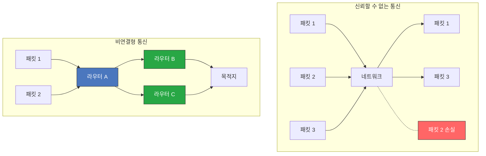
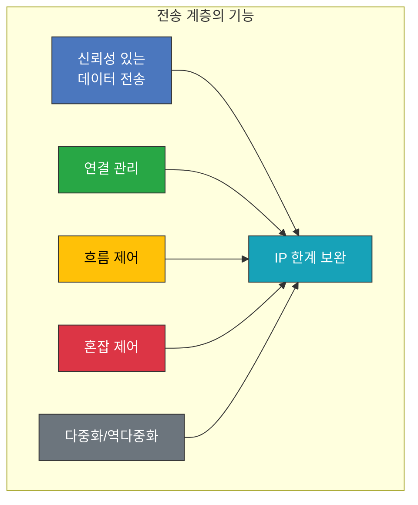
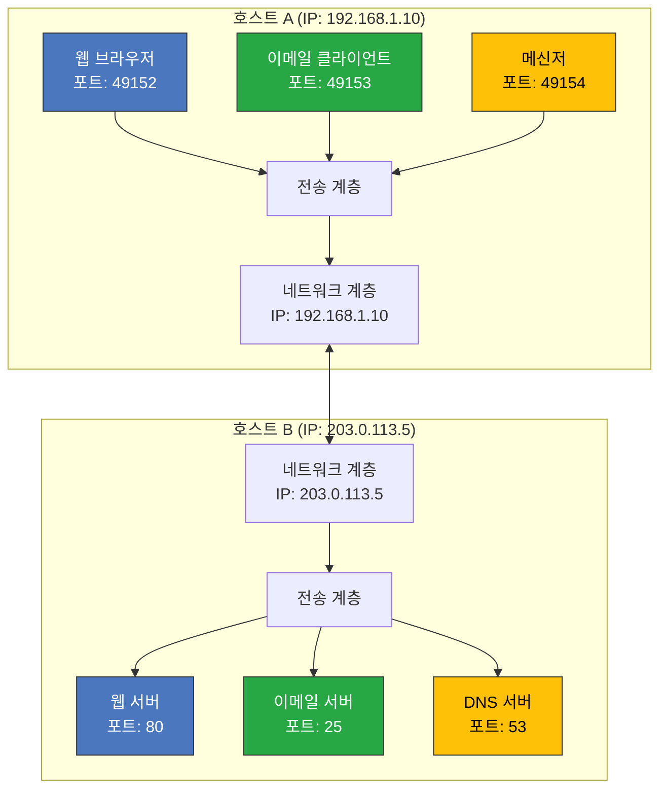
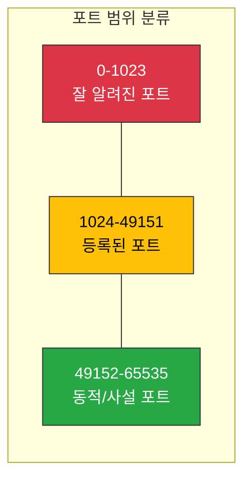
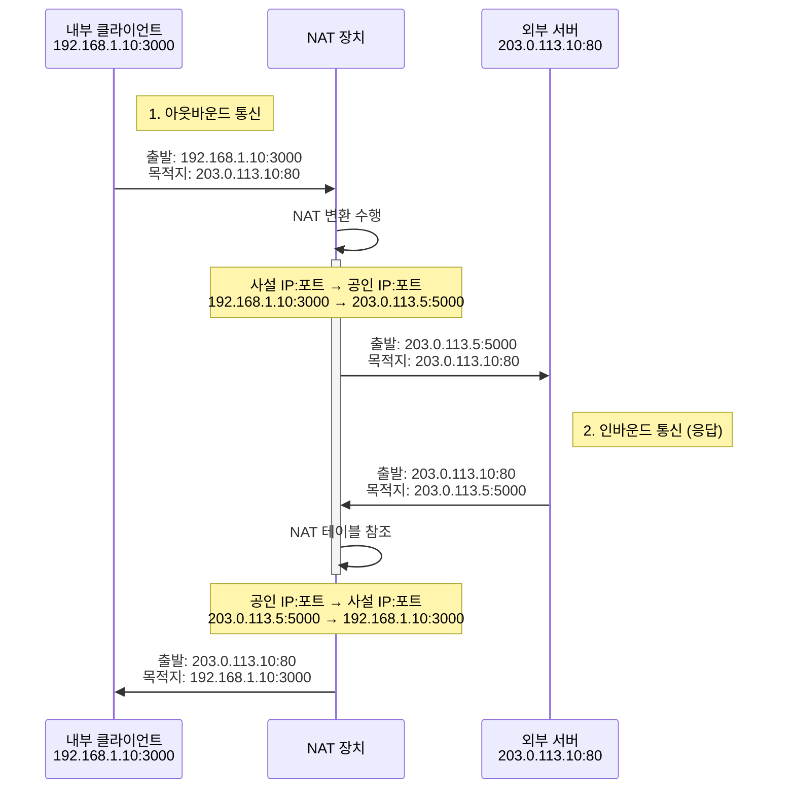
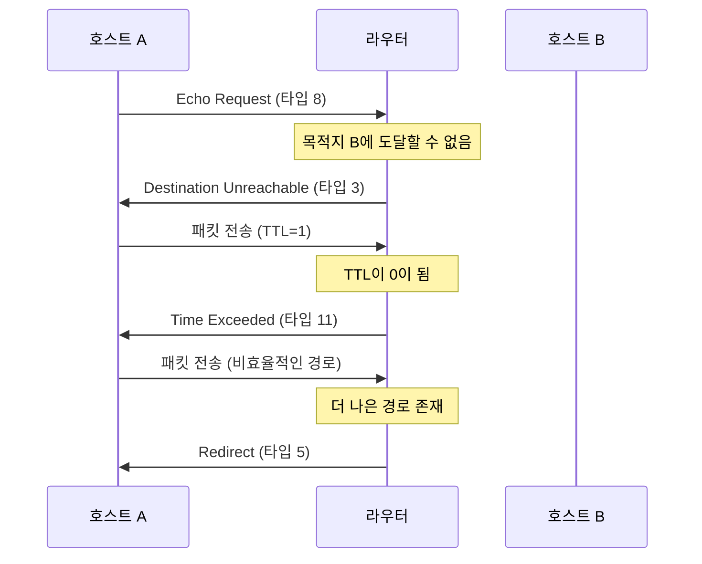

# Chapter 04 전송 계층

## 04-1 전송 계층 개요: IP의 한계와 포트

### 개요
이 섹션에서는 네트워크 계층(IP)의 한계점과 이를 보완하는 전송 계층의 역할에 대해 살펴봅니다. 신뢰할 수 없는 통신과 비연결형 통신의 개념, 전송 계층이 IP의 한계를 어떻게 보완하는지, 그리고 응용 계층과의 연결 다리 역할을 하는 포트의 개념과 분류에 대해 학습합니다. 또한 포트 기반 NAT의 작동 원리와 포트 포워딩, ICMP에 대해서도 알아봅니다. 이를 통해 인터넷 통신의 신뢰성과 다중 애플리케이션 지원 메커니즘을 이해하고, 네트워크 문제 해결에 필요한 지식을 습득합니다.

### 신뢰할 수 없는 통신과 비연결형 통신

네트워크 계층의 IP 프로토콜은 다음과 같은 두 가지 주요 특성을 가지고 있습니다: 신뢰할 수 없는(unreliable) 통신과 비연결형(connectionless) 통신. 이러한 특성은 IP의 설계 철학을 반영하며, 인터넷의 확장성과 유연성을 가능하게 했지만 동시에 한계점도 가지고 있습니다.

#### 신뢰할 수 없는 통신

IP는 기본적으로 **최선형 전달(best-effort delivery)** 방식을 사용합니다. 이는 패킷 전달을 보장하지 않는다는 의미입니다.

**특징**:
- 패킷 손실 가능성: 네트워크 혼잡, 버퍼 오버플로우, 라우터 장애 등으로 패킷이 손실될 수 있습니다.
- 순서 보장 없음: 패킷이 전송된 순서와 다른 순서로 도착할 수 있습니다.
- 중복 패킷 가능성: 동일한 패킷이 중복되어 전달될 수 있습니다.
- 오류 제어 제한: IP 헤더에 대한 체크섬은 있지만, 데이터 부분의 오류는 검출하지 않습니다.

**예시**:
인터넷을 통해 파일을 다운로드할 때, IP 계층만 사용한다면 파일의 일부가 손실되거나, 순서가 뒤바뀌거나, 중복되어 전송될 수 있습니다. 이는 파일이 손상되거나 사용할 수 없게 될 가능성이 높습니다.

#### 비연결형 통신

IP는 **비연결형(connectionless)** 프로토콜로, 통신 전에 연결을 설정하지 않고 각 패킷이 독립적으로 처리됩니다.

**특징**:
- 연결 설정 과정 없음: 데이터 전송 전에 연결을 설정하는 과정이 없습니다.
- 상태 정보 없음: 라우터는 이전에 전송된 패킷에 대한 정보를 유지하지 않습니다.
- 독립적인 패킷 처리: 각 패킷은 독립적으로 라우팅되며, 같은 출발지와 목적지를 가진 패킷이라도 다른 경로로 전송될 수 있습니다.
- 종단 간 흐름 제어 없음: 송신자와 수신자 간의 데이터 전송 속도를 조절하는 메커니즘이 없습니다.

**예시**:
편지를 보내는 것과 유사합니다. 각 편지는 독립적으로 처리되며, 우체국은 이전에 보낸 편지에 대한 정보를 기억하지 않습니다. 여러 편지를 보낼 때 각각 다른 경로로 전달될 수 있으며, 일부는 분실되거나 순서가 바뀔 수 있습니다.



#### IP 통신의 장단점

**장점**:
- 단순성: 복잡한 연결 관리가 필요 없어 구현이 간단합니다.
- 확장성: 상태 정보를 유지하지 않아 대규모 네트워크에서도 효율적으로 동작합니다.
- 유연성: 다양한 네트워크 환경과 토폴로지에 적응할 수 있습니다.
- 효율성: 오버헤드가 적어 네트워크 리소스를 효율적으로 사용합니다.

**단점**:
- 신뢰성 부족: 패킷 전달을 보장하지 않아 중요한 데이터 전송에 적합하지 않습니다.
- 순서 보장 없음: 패킷이 순서대로 도착하지 않을 수 있어 순서가 중요한 데이터에 문제가 될 수 있습니다.
- 흐름 제어 부재: 송신자가 수신자의 처리 능력을 초과하는 속도로 데이터를 전송할 수 있습니다.
- 혼잡 제어 부재: 네트워크 혼잡 상황에서 패킷 손실이 증가할 수 있습니다.

이러한 IP의 한계점을 보완하기 위해 전송 계층 프로토콜(TCP, UDP)이 필요하게 되었습니다.

### IP의 한계를 보완하는 전송 계층

전송 계층(Transport Layer)은 OSI 모델의 4계층으로, 네트워크 계층(IP)의 한계를 보완하여 종단 간(end-to-end) 통신의 신뢰성과 효율성을 향상시키는 역할을 합니다.

#### 전송 계층의 주요 기능

전송 계층은 다음과 같은 주요 기능을 통해 IP의 한계를 보완합니다:

1. **신뢰성 있는 데이터 전송**:
   - 패킷 손실 감지 및 재전송
   - 중복 패킷 제거
   - 오류 검출 및 복구
   - 순서 보장

2. **연결 관리**:
   - 연결 설정 및 해제
   - 연결 상태 유지
   - 세션 관리

3. **흐름 제어(Flow Control)**:
   - 송신자와 수신자 간의 데이터 전송 속도 조절
   - 수신자의 처리 능력을 고려한 데이터 전송
   - 버퍼 오버플로우 방지

4. **혼잡 제어(Congestion Control)**:
   - 네트워크 혼잡 상태 감지
   - 혼잡 시 데이터 전송 속도 조절
   - 네트워크 자원의 효율적 사용

5. **다중화와 역다중화(Multiplexing/Demultiplexing)**:
   - 여러 애플리케이션의 데이터를 하나의 네트워크 연결로 전송
   - 수신된 데이터를 올바른 애플리케이션에 전달
   - 포트 번호를 통한 서비스 식별



#### 주요 전송 계층 프로토콜

전송 계층에는 두 가지 주요 프로토콜이 있으며, 각각 다른 특성과 용도를 가지고 있습니다:

1. **TCP(Transmission Control Protocol)**:
   - 연결 지향적(connection-oriented)
   - 신뢰성 있는 데이터 전송
   - 순서 보장
   - 흐름 제어 및 혼잡 제어
   - 오류 검출 및 복구
   - 예: 웹 브라우징(HTTP), 이메일(SMTP), 파일 전송(FTP)

2. **UDP(User Datagram Protocol)**:
   - 비연결형(connectionless)
   - 신뢰성 없는 데이터 전송
   - 순서 보장 없음
   - 흐름 제어 및 혼잡 제어 없음
   - 최소한의 오류 검출
   - 낮은 오버헤드와 빠른 전송
   - 예: DNS 조회, 스트리밍 미디어, 온라인 게임, VoIP

#### TCP와 UDP 비교

| 특성 | TCP | UDP |
|------|-----|-----|
| 연결 방식 | 연결 지향적 | 비연결형 |
| 신뢰성 | 높음 (패킷 손실 복구) | 낮음 (패킷 손실 복구 없음) |
| 순서 보장 | 있음 | 없음 |
| 속도 | 상대적으로 느림 | 빠름 |
| 오버헤드 | 높음 | 낮음 |
| 흐름 제어 | 있음 | 없음 |
| 혼잡 제어 | 있음 | 없음 |
| 헤더 크기 | 20-60 바이트 | 8 바이트 |
| 적합한 용도 | 신뢰성이 중요한 애플리케이션 | 속도가 중요한 실시간 애플리케이션 |

#### 전송 계층이 웹 개발에 미치는 영향

웹 개발자에게 전송 계층의 이해는 다음과 같은 이유로 중요합니다:

1. **성능 최적화**:
   - TCP의 연결 설정 오버헤드 이해 (HTTP/1.1의 Keep-Alive, HTTP/2의 멀티플렉싱)
   - 적절한 프로토콜 선택 (WebSocket, WebRTC 등)

2. **문제 해결**:
   - 네트워크 지연 및 타임아웃 문제 진단
   - 패킷 손실로 인한 성능 저하 이해

3. **보안 고려사항**:
   - TCP 기반 공격(SYN 플러드 등) 이해
   - 포트 스캐닝 및 방화벽 설정

4. **실시간 애플리케이션 개발**:
   - 실시간 통신에 적합한 프로토콜 선택 (UDP 기반 WebRTC 등)
   - 지연 시간과 신뢰성 간의 균형

### 응용 계층과의 연결 다리, 포트

전송 계층의 중요한 기능 중 하나는 다중화와 역다중화를 통해 여러 애플리케이션이 동시에 네트워크를 사용할 수 있게 하는 것입니다. 이를 가능하게 하는 핵심 개념이 바로 **포트(Port)**입니다.

#### 포트의 정의

포트는 특정 프로세스나 애플리케이션을 식별하는 16비트(0-65535) 숫자입니다. IP 주소가 특정 호스트를 식별한다면, 포트 번호는 해당 호스트 내의 특정 프로세스나 서비스를 식별합니다.



포트의 주요 특징:
- 각 포트는 특정 시점에 하나의 프로세스만 사용할 수 있습니다.
- 포트는 전송 계층 프로토콜(TCP 또는 UDP)과 연결됩니다.
- 같은 포트 번호라도 TCP와 UDP에서 별도로 사용할 수 있습니다(예: DNS는 TCP 53번과 UDP 53번 포트 모두 사용).
- 소켓(Socket)은 IP 주소와 포트 번호의 조합으로, 네트워크 통신의 종단점을 식별합니다.

#### 포트의 분류

포트 번호는 IANA(Internet Assigned Numbers Authority)에 의해 다음과 같이 세 가지 범위로 분류됩니다:

1. **잘 알려진 포트(Well-Known Ports)**: 0-1023
   - 표준화된 서비스를 위해 예약된 포트
   - 일반적으로 시스템 프로세스나 특권 있는 프로그램만 사용 가능
   - 예시:
     - 20, 21: FTP (파일 전송)
     - 22: SSH (보안 셸)
     - 23: Telnet
     - 25: SMTP (이메일 전송)
     - 53: DNS (도메인 이름 해석)
     - 80: HTTP (웹)
     - 443: HTTPS (보안 웹)

2. **등록된 포트(Registered Ports)**: 1024-49151
   - 기업이나 단체가 특정 애플리케이션을 위해 등록한 포트
   - IANA에 등록되어 있지만, 특권이 필요하지 않음
   - 예시:
     - 1433: Microsoft SQL Server
     - 3306: MySQL
     - 5432: PostgreSQL
     - 8080: 대체 HTTP 포트
     - 27017: MongoDB

3. **동적/사설 포트(Dynamic/Private Ports)**: 49152-65535
   - 임시 포트 또는 사설 용도로 사용
   - 클라이언트 애플리케이션이 서버에 연결할 때 소스 포트로 자동 할당
   - 특별한 등록이나 제한 없이 자유롭게 사용 가능



#### 포트 번호와 서비스 매핑

운영 체제는 `/etc/services` 파일(유닉스/리눅스) 또는 이와 유사한 데이터베이스를 통해 포트 번호와 서비스 이름 간의 매핑을 유지합니다. 이 파일의 일부 예시:

```
# /etc/services 파일 예시
http    80/tcp    www
https   443/tcp   www-https
smtp    25/tcp    mail
dns     53/tcp    domain
dns     53/udp    domain
ssh     22/tcp    
ftp     21/tcp    
```

#### 포트 스캐닝과 보안

포트 번호는 네트워크 보안에서 중요한 역할을 합니다:

- **포트 스캐닝**: 공격자가 열린 포트를 찾아 취약점을 탐색하는 기술
- **방화벽**: 특정 포트로의 접근을 제한하여 보안 강화
- **포트 차단**: 불필요한 서비스의 포트를 차단하여 공격 표면 감소
- **포트 리다이렉션**: 특정 포트로의 트래픽을 다른 포트로 리다이렉트

웹 개발자는 애플리케이션이 사용하는 포트와 관련된 보안 위험을 이해하고, 적절한 보안 조치를 취해야 합니다.

### 포트 기반 NAT

앞서 03-2 IP 주소 장에서 NAT(Network Address Translation)에 대해 간략히 살펴보았습니다. 이번에는 포트 개념을 활용한 포트 기반 NAT에 대해 더 자세히 알아보겠습니다.

#### NAT 변환 테이블

NAT는 사설 IP 주소와 공인 IP 주소 간의 변환을 수행하는 기술입니다. 포트 기반 NAT에서는 IP 주소뿐만 아니라 포트 번호도 함께 변환하여 여러 내부 장치가 하나의 공인 IP 주소를 공유할 수 있게 합니다.

NAT 장치(라우터)는 변환 정보를 NAT 변환 테이블(NAT Translation Table)에 저장합니다. 이 테이블은 다음과 같은 정보를 포함합니다:

- 내부 IP 주소 (사설 IP)
- 내부 포트 번호
- 외부 IP 주소 (공인 IP)
- 외부 포트 번호
- 프로토콜 유형 (TCP/UDP)
- 타임아웃 값

**NAT 변환 테이블 예시**:

| 내부 IP:포트 | 외부 IP:포트 | 프로토콜 | 타임아웃(초) |
|-------------|-------------|---------|------------|
| 192.168.1.10:3000 | 203.0.113.5:5000 | TCP | 3600 |
| 192.168.1.20:4000 | 203.0.113.5:5001 | TCP | 3600 |
| 192.168.1.30:5000 | 203.0.113.5:5002 | UDP | 300 |

#### NAPT (Network Address Port Translation)

NAPT는 가장 일반적인 형태의 NAT로, 포트 주소 변환(PAT, Port Address Translation) 또는 IP 마스커레이딩(IP Masquerading)이라고도 합니다. NAPT는 여러 내부 호스트가 하나의 공인 IP 주소를 공유할 수 있게 해주는 기술입니다.

**NAPT의 작동 과정**:

1. **내부에서 외부로의 통신 (아웃바운드)**:
   - 내부 호스트가 외부 서버로 패킷을 전송합니다.
   - NAT 장치는 내부 IP 주소와 포트를 공인 IP 주소와 새로운 포트로 변환합니다.
   - 변환 정보를 NAT 테이블에 저장합니다.
   - 변환된 패킷을 외부 서버로 전송합니다.

2. **외부에서 내부로의 통신 (인바운드)**:
   - 외부 서버가 NAT 장치의 공인 IP 주소와 포트로 응답 패킷을 전송합니다.
   - NAT 장치는 NAT 테이블을 참조하여 해당 공인 IP 주소와 포트에 매핑된 내부 IP 주소와 포트를 찾습니다.
   - 패킷의 목적지 주소와 포트를 내부 IP 주소와 포트로 변환합니다.
   - 변환된 패킷을 내부 호스트로 전송합니다.



#### NAPT의 장점과 한계

**장점**:
- **IP 주소 절약**: 여러 내부 장치가 하나의 공인 IP 주소를 공유할 수 있습니다.
- **보안 강화**: 내부 네트워크 구조가 외부에서 직접 보이지 않습니다.
- **유연한 내부 네트워크 구성**: 내부 IP 주소 체계를 자유롭게 구성할 수 있습니다.

**한계**:
- **연결 추적 오버헤드**: 모든 연결을 추적해야 하므로 대규모 트래픽에서 성능 저하가 발생할 수 있습니다.
- **외부에서 내부로의 연결 시작 어려움**: 외부에서 내부 서버로의 직접 연결이 기본적으로 불가능합니다(포트 포워딩으로 해결 가능).
- **일부 프로토콜 호환성 문제**: IP 주소를 페이로드에 포함하는 일부 프로토콜(FTP, SIP 등)은 추가 처리가 필요합니다.
- **P2P 통신의 어려움**: 피어 간 직접 연결이 어려워 P2P 애플리케이션에 문제가 발생할 수 있습니다.

#### 웹 개발자에게 NAPT가 중요한 이유

웹 개발자에게 NAPT의 이해는 다음과 같은 이유로 중요합니다:

1. **클라이언트 식별**: NAT 뒤의 여러 클라이언트가 동일한 공인 IP 주소를 가질 수 있으므로, IP 주소만으로 사용자를 식별하는 것은 신뢰할 수 없습니다.

2. **WebRTC와 같은 P2P 기술**: NAT 환경에서 P2P 연결을 설정하기 위해 STUN, TURN과 같은 기술이 필요합니다.

3. **서버 배포**: 개발 서버를 외부에 공개하려면 포트 포워딩이나 다른 NAT 통과 기술이 필요할 수 있습니다.

4. **연결 제한**: NAT 장치는 연결 수에 제한이 있을 수 있으므로, 많은 동시 연결을 사용하는 애플리케이션은 문제가 발생할 수 있습니다.

### [좀 더 알아보기] 포트 포워딩

포트 포워딩(Port Forwarding)은 NAT 환경에서 외부에서 내부 네트워크의 특정 서비스에 접근할 수 있게 해주는 기술입니다. 기본적으로 NAT는 외부에서 시작된 연결을 차단하지만, 포트 포워딩을 통해 특정 포트로 들어오는 트래픽을 내부 네트워크의 특정 장치와 포트로 전달할 수 있습니다.

#### 포트 포워딩의 작동 원리

포트 포워딩은 다음과 같은 과정으로 작동합니다:

1. NAT 라우터에 특정 규칙을 설정합니다:
   - 외부 포트 번호
   - 내부 IP 주소
   - 내부 포트 번호
   - 프로토콜 유형(TCP/UDP)

2. 외부에서 NAT 라우터의 공인 IP 주소와 지정된 포트로 패킷이 도착하면, 라우터는 설정된 규칙에 따라 패킷을 내부 IP 주소와 포트로 전달합니다.


#### 포트 포워딩 설정 예시

대부분의 가정용/소규모 비즈니스용 라우터는 관리 인터페이스를 통해 포트 포워딩을 설정할 수 있습니다. 일반적인 설정 예시:

| 외부 포트 | 내부 IP | 내부 포트 | 프로토콜 | 설명 |
|----------|---------|----------|---------|------|
| 80 | 192.168.1.10 | 8080 | TCP | 웹 서버 |
| 443 | 192.168.1.10 | 8443 | TCP | 보안 웹 서버 |
| 22 | 192.168.1.20 | 22 | TCP | SSH 서버 |
| 25565 | 192.168.1.30 | 25565 | TCP/UDP | 게임 서버 |

#### 포트 포워딩의 용도

포트 포워딩은 다음과 같은 상황에서 유용합니다:

1. **웹 서버 호스팅**: 가정이나 소규모 사무실에서 웹 서버를 운영하고 인터넷에 공개할 때
2. **원격 접속**: 내부 네트워크의 컴퓨터에 SSH나 RDP를 통해 원격으로 접속할 때
3. **게임 서버**: 멀티플레이어 게임의 호스트 서버를 운영할 때
4. **IoT 장치**: 내부 네트워크의 IoT 장치에 외부에서 접근할 때
5. **P2P 애플리케이션**: 토렌트와 같은 P2P 애플리케이션의 성능 향상을 위해

#### 포트 포워딩과 보안

포트 포워딩은 편리하지만 보안 위험을 증가시킬 수 있습니다:

- **공격 표면 증가**: 내부 서비스를 인터넷에 노출시켜 공격 가능성이 높아집니다.
- **취약점 악용**: 포워딩된 서비스에 보안 취약점이 있으면 공격자가 이를 악용할 수 있습니다.
- **무단 접근**: 인증이 약한 서비스는 무단 접근의 위험이 있습니다.

따라서 포트 포워딩을 설정할 때는 다음과 같은 보안 조치를 취하는 것이 좋습니다:

1. 필요한 포트만 개방
2. 강력한 인증 메커니즘 사용
3. 서비스 소프트웨어를 최신 상태로 유지
4. 가능하면 VPN을 통한 접근 고려
5. 방화벽 규칙으로 접근 제한

#### 웹 개발자를 위한 포트 포워딩 활용

웹 개발자는 다음과 같은 상황에서 포트 포워딩을 활용할 수 있습니다:

1. **로컬 개발 환경 공유**: 개발 중인 웹사이트를 클라이언트나 팀원에게 일시적으로 보여줄 때
2. **테스트 환경 구축**: 클라우드 서비스 없이 테스트 서버를 운영할 때
3. **WebRTC 애플리케이션**: P2P 연결이 필요한 실시간 통신 애플리케이션 개발 시
4. **API 테스트**: 외부 서비스와의 웹훅(webhook) 통합 테스트 시

### [좀 더 알아보기] ICMP

ICMP(Internet Control Message Protocol)는 IP 네트워크의 진단과 제어를 위한 프로토콜입니다. ICMP는 네트워크 계층에서 동작하지만, 전송 계층과 밀접한 관련이 있어 함께 살펴볼 필요가 있습니다.

#### ICMP의 역할

ICMP는 다음과 같은 주요 역할을 수행합니다:

1. **오류 보고**: IP 패킷 전달 중 발생한 문제를 보고합니다.
2. **네트워크 진단**: 네트워크 연결성과 상태를 확인합니다.
3. **경로 탐색**: 최적의 패킷 크기나 경로를 결정하는 데 도움을 줍니다.
4. **흐름 제어**: 송신자에게 패킷 전송 속도를 조절하도록 알립니다.

ICMP는 IP 패킷 내에 캡슐화되어 전송되며, IP 헤더의 프로토콜 필드 값은 1입니다.

#### ICMP 메시지 구조

ICMP 메시지는 다음과 같은 기본 구조를 가집니다:

1. **타입(Type)**: 메시지의 종류를 나타내는 8비트 필드
2. **코드(Code)**: 타입 내의 세부 정보를 나타내는 8비트 필드
3. **체크섬(Checksum)**: 메시지의 무결성을 검증하는 16비트 필드
4. **메시지 본문**: 타입과 코드에 따라 다양한 형식의 데이터

#### 주요 ICMP 메시지 타입

ICMP에는 다양한 메시지 타입이 있으며, 가장 일반적인 것들은 다음과 같습니다:

1. **Echo Request/Reply (타입 8/0)**:
   - 일반적으로 'ping' 명령에 사용됩니다.
   - 네트워크 연결성과 왕복 시간을 확인합니다.

2. **Destination Unreachable (타입 3)**:
   - 패킷이 목적지에 도달할 수 없을 때 발생합니다.
   - 다양한 코드로 구체적인 이유를 나타냅니다:
     - 코드 0: 네트워크에 도달할 수 없음
     - 코드 1: 호스트에 도달할 수 없음
     - 코드 3: 포트에 도달할 수 없음 (포트가 닫혀 있음)
     - 코드 4: 단편화가 필요하지만 DF 비트가 설정됨

3. **Time Exceeded (타입 11)**:
   - TTL이 0이 되어 패킷이 폐기될 때 발생합니다.
   - 'traceroute' 명령에 활용됩니다.

4. **Redirect (타입 5)**:
   - 더 나은 경로가 있을 때 라우터가 호스트에게 알립니다.



#### ICMP와 전송 계층의 관계

ICMP는 네트워크 계층 프로토콜이지만, 전송 계층과 다음과 같은 관계가 있습니다:

1. **포트 도달 불가 메시지**: ICMP "Destination Unreachable" 메시지의 코드 3(포트 도달 불가)은 전송 계층의 포트가 닫혀 있거나 접근할 수 없을 때 발생합니다.

2. **경로 MTU 발견**: TCP는 ICMP "Fragmentation Needed" 메시지를 사용하여 최적의 패킷 크기(MSS)를 결정합니다.

3. **네트워크 진단**: 전송 계층 연결 문제를 진단할 때 ICMP 메시지가 중요한 정보를 제공합니다.

4. **혼잡 제어**: 일부 라우터는 ICMP "Source Quench" 메시지(현재는 사용되지 않음)를 통해 혼잡 상황을 알렸습니다.

#### 웹 개발자에게 ICMP가 중요한 이유

웹 개발자에게 ICMP의 이해는 다음과 같은 이유로 중요합니다:

1. **네트워크 문제 진단**:
   - 서버 연결 문제 발생 시 ping이나 traceroute와 같은 ICMP 기반 도구로 문제를 진단할 수 있습니다.
   - 네트워크 지연이나 패킷 손실의 원인을 파악할 수 있습니다.

2. **방화벽 설정 이해**:
   - 많은 방화벽이 ICMP 트래픽을 차단하므로, 네트워크 진단 도구가 작동하지 않을 수 있습니다.
   - 서버 환경 구성 시 적절한 ICMP 규칙을 설정해야 합니다.

3. **성능 최적화**:
   - PMTUD(Path MTU Discovery)를 통한 최적의 패킷 크기 설정으로 성능을 향상시킬 수 있습니다.

4. **보안 고려사항**:
   - ICMP 기반 공격(예: ICMP 플러드, Ping of Death)에 대한 이해와 방어가 필요합니다.
   - 불필요한 ICMP 응답은 서버 정보 노출의 위험이 있습니다.

### 6가지 키워드로 정리하는 핵심 포인트

1. **신뢰할 수 없는 통신**: IP는 최선형 전달 방식을 사용하며 패킷 손실, 순서 변경, 중복 전송 등이 발생할 수 있어 신뢰성이 보장되지 않음

2. **전송 계층**: OSI 모델의 4계층으로, IP의 한계를 보완하여 신뢰성 있는 데이터 전송, 연결 관리, 흐름 제어, 혼잡 제어, 다중화/역다중화 기능을 제공

3. **TCP와 UDP**: 전송 계층의 두 가지 주요 프로토콜로, TCP는 연결 지향적이고 신뢰성 있는 전송을 제공하며, UDP는 비연결형이고 빠르지만 신뢰성이 낮음

4. **포트**: 특정 프로세스나 애플리케이션을 식별하는 16비트 숫자로, 여러 애플리케이션이 동시에 네트워크를 사용할 수 있게 하는 다중화/역다중화의 핵심 요소

5. **포트 기반 NAT**: IP 주소와 포트 번호를 함께 변환하여 여러 내부 장치가 하나의 공인 IP 주소를 공유할 수 있게 하는 기술로, 인터넷의 IPv4 주소 부족 문제를 완화

6. **ICMP**: IP 네트워크의 진단과 제어를 위한 프로토콜로, 오류 보고, 네트워크 진단, 경로 탐색 등의 역할을 수행하며 ping이나 traceroute와 같은 네트워크 진단 도구의 기반

### 확인 문제

1. 다음 중 IP 프로토콜의 특성으로 옳지 않은 것은?
   - [ ] 비연결형 통신을 제공한다
   - [ ] 최선형 전달 방식을 사용한다
   - [ ] 패킷 순서가 바뀔 수 있다
   - [ ] 신뢰성 있는 데이터 전송을 보장한다

2. 전송 계층의 주요 기능이 아닌 것은?
   - [ ] 흐름 제어
   - [ ] 혼잡 제어
   - [ ] 다중화와 역다중화
   - [ ] 라우팅 경로 결정

3. 다음 중 TCP와 UDP의 차이점으로 옳지 않은 것은?
   - [ ] TCP는 연결 지향적이고, UDP는 비연결형이다
   - [ ] TCP는 신뢰성 있는 전송을 제공하고, UDP는 신뢰성을 보장하지 않는다
   - [ ] TCP는 항상 UDP보다 빠른 전송 속도를 제공한다
   - [ ] TCP는 흐름 제어와 혼잡 제어를 제공하고, UDP는 제공하지 않는다

4. 다음 중 잘 알려진 포트(Well-Known Ports)의 범위는?
   - [ ] 0-1023
   - [ ] 1024-49151
   - [ ] 49152-65535
   - [ ] 0-65535

5. NAPT(Network Address Port Translation)에 대한 설명으로 옳은 것은?
   - [ ] 내부 IP 주소만 변환하고 포트 번호는 변환하지 않는다
   - [ ] 여러 내부 호스트가 하나의 공인 IP 주소를 공유할 수 있게 한다
   - [ ] 외부에서 내부 서버로의 연결을 항상 자동으로 허용한다
   - [ ] IPv6 네트워크에서만 사용된다

6. 다음 중 ICMP의 주요 역할이 아닌 것은?
   - [ ] 네트워크 오류 보고
   - [ ] 네트워크 연결성 확인
   - [ ] 데이터 암호화 및 보안
   - [ ] 경로 탐색 지원

> [정답 및 해설 보기](../answers_and_explanations.md#04-1-전송-계층-개요-ip의-한계와-포트)