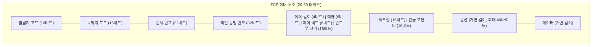
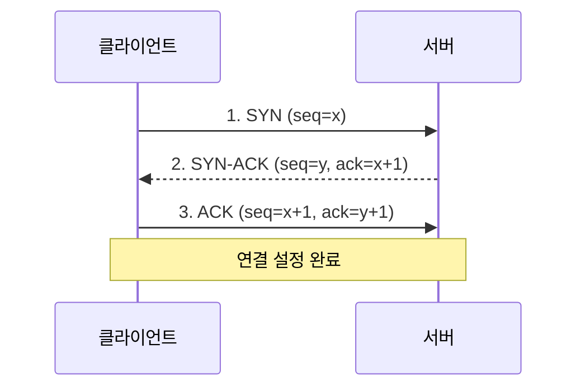
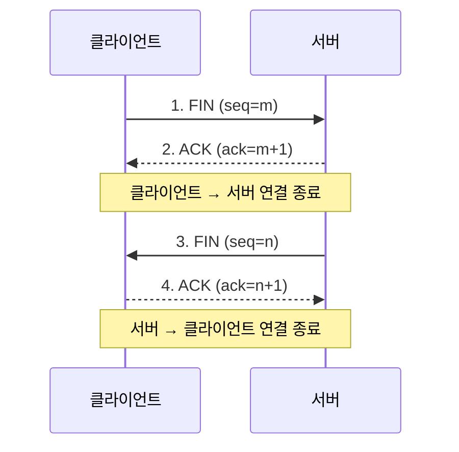
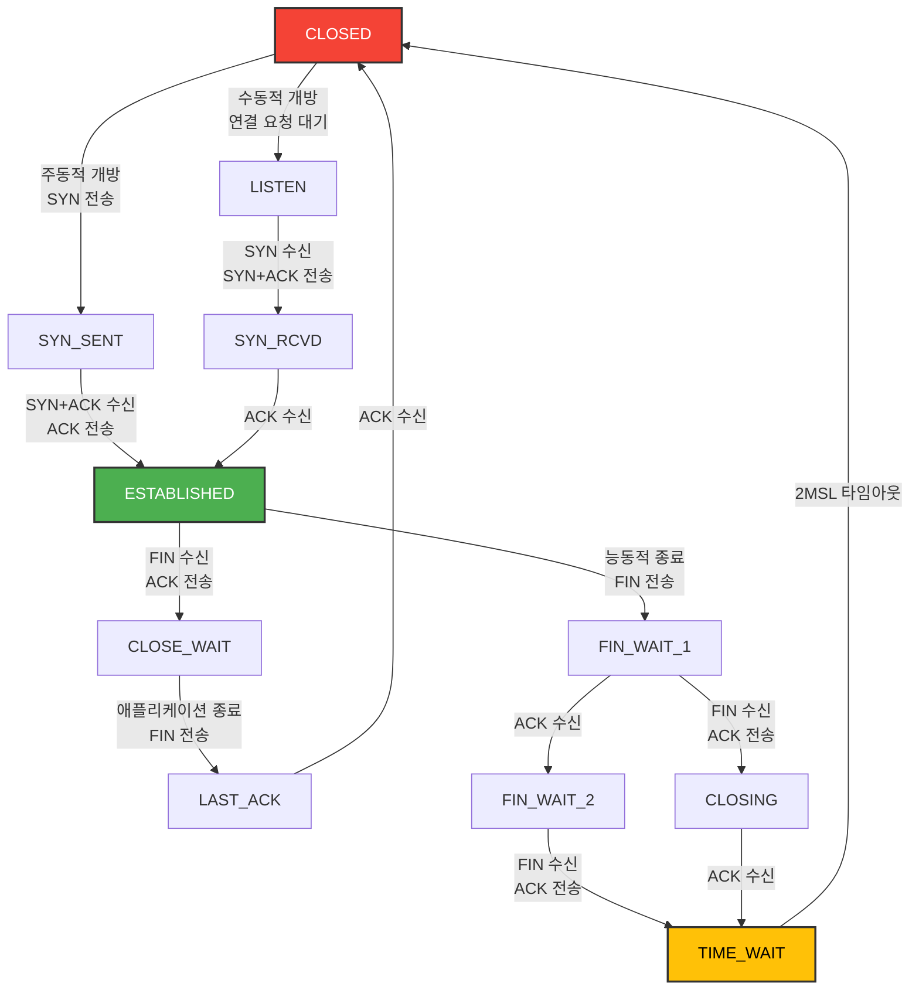
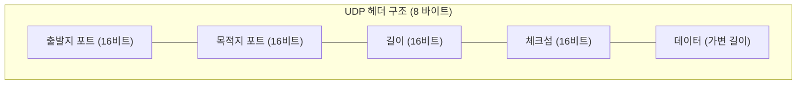
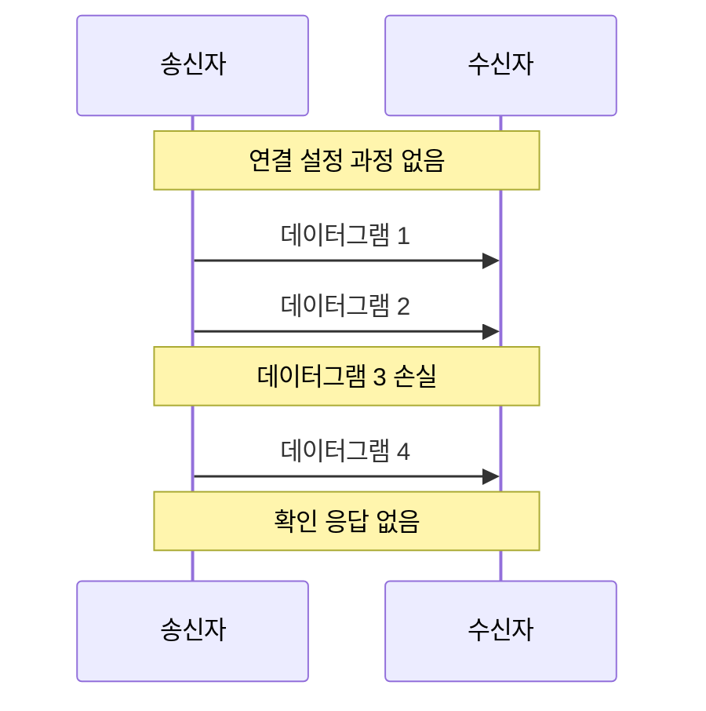
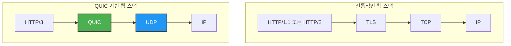

# Chapter 04 전송 계층

## 04-2 TCP와 UDP

### 개요
이 섹션에서는 전송 계층의 두 가지 핵심 프로토콜인 TCP(Transmission Control Protocol)와 UDP(User Datagram Protocol)에 대해 자세히 알아봅니다. 두 프로토콜의 특징, 헤더 구조, 작동 방식, 그리고 각각의 장단점과 적합한 사용 사례를 비교 분석합니다. 이를 통해 웹 개발자로서 애플리케이션의 요구사항에 맞는 적절한 프로토콜을 선택하고 활용할 수 있는 지식을 습득합니다.

### TCP(Transmission Control Protocol)

TCP는 인터넷 프로토콜 스위트의 핵심 프로토콜 중 하나로, 신뢰성 있는 데이터 전송을 보장하는 연결 지향적 프로토콜입니다. 웹 브라우징(HTTP), 이메일(SMTP), 파일 전송(FTP) 등 대부분의 인터넷 애플리케이션에서 사용됩니다.

#### TCP의 주요 특징

TCP는 다음과 같은 주요 특징을 가지고 있습니다:

1. **연결 지향적(Connection-oriented)**: 데이터 전송 전에 3-way 핸드셰이크를 통해 연결을 설정합니다.
2. **신뢰성 있는 전송**: 데이터 손실, 중복, 순서 변경 등의 문제를 해결하여 신뢰성 있는 전송을 보장합니다.
3. **흐름 제어**: 수신자의 처리 능력에 맞게 데이터 전송 속도를 조절합니다.
4. **혼잡 제어**: 네트워크 혼잡 상태를 감지하고 대응하여 네트워크 성능을 최적화합니다.
5. **전이중 통신(Full-duplex Communication)**: 양방향으로 동시에 데이터를 주고받을 수 있습니다.
6. **바이트 스트림(Byte Stream)**: 데이터를 연속된 바이트 스트림으로 처리합니다.

#### TCP 헤더 구조

TCP 헤더는 다양한 제어 정보를 포함하고 있으며, 기본적으로 20바이트(옵션 필드 제외)의 크기를 가집니다.

**주요 필드 설명**:

1. **출발지 포트(Source Port)**: 송신 애플리케이션의 포트 번호 (16비트)
2. **목적지 포트(Destination Port)**: 수신 애플리케이션의 포트 번호 (16비트)
3. **순서 번호(Sequence Number)**: 세그먼트의 첫 번째 데이터 바이트 순서 번호 (32비트)
4. **확인 응답 번호(Acknowledgment Number)**: 다음에 수신할 것으로 예상되는 바이트 순서 번호 (32비트)
5. **헤더 길이(Data Offset)**: TCP 헤더의 크기(32비트 워드 단위) (4비트)
6. **제어 비트(Control Bits)**: 6개의 1비트 플래그 (URG, ACK, PSH, RST, SYN, FIN)
7. **윈도우 크기(Window Size)**: 수신 윈도우 크기(바이트 단위) (16비트)
8. **체크섬(Checksum)**: 헤더와 데이터를 포함한 전체 세그먼트의 무결성 검사 (16비트)
9. **긴급 포인터(Urgent Pointer)**: URG 플래그가 설정된 경우 긴급 데이터의 마지막 바이트 위치 (16비트)
10. **옵션(Options)**: 추가 옵션(최대 세그먼트 크기, 윈도우 스케일링 등) (가변 길이)

#### TCP 연결 관리

TCP는 연결 지향적 프로토콜로, 데이터 전송 전에 연결을 설정하고 데이터 전송 후에 연결을 종료합니다.

##### 3-way 핸드셰이크 (연결 설정)

TCP 연결은 3-way 핸드셰이크 과정을 통해 설정됩니다:

1. **클라이언트 → 서버**: SYN 플래그를 설정하고 초기 순서 번호(x)를 포함한 세그먼트를 전송합니다.
2. **서버 → 클라이언트**: SYN과 ACK 플래그를 설정하고, 자신의 초기 순서 번호(y)와 클라이언트의 순서 번호에 1을 더한 확인 응답 번호(x+1)를 포함한 세그먼트를 전송합니다.
3. **클라이언트 → 서버**: ACK 플래그를 설정하고, 서버의 순서 번호에 1을 더한 확인 응답 번호(y+1)를 포함한 세그먼트를 전송합니다.

이 과정을 통해 양방향 통신을 위한 연결이 설정되고, 양쪽의 초기 순서 번호가 동기화됩니다.

##### 4-way 핸드셰이크 (연결 종료)

TCP 연결 종료는 4-way 핸드셰이크 과정을 통해 이루어집니다:

1. **클라이언트 → 서버**: FIN 플래그를 설정한 세그먼트를 전송합니다.
2. **서버 → 클라이언트**: ACK 플래그를 설정한 세그먼트로 응답합니다.
3. **서버 → 클라이언트**: 모든 데이터 전송을 완료한 후, FIN 플래그를 설정한 세그먼트를 전송합니다.
4. **클라이언트 → 서버**: ACK 플래그를 설정한 세그먼트로 응답합니다.

이 과정을 통해 양방향 연결이 모두 종료됩니다. 연결 종료 후에도 클라이언트는 일정 시간(TIME_WAIT 상태) 동안 대기하여 지연된 패킷이 있을 경우 처리합니다.

#### TCP 상태 전이도

TCP 연결은 다양한 상태를 거치며, 이를 상태 전이도(State Transition Diagram)로 표현할 수 있습니다:

주요 상태:
- **CLOSED**: 연결이 없는 상태
- **LISTEN**: 연결 요청을 기다리는 상태
- **SYN_SENT**: 연결 요청을 보내고 응답을 기다리는 상태
- **SYN_RCVD**: 연결 요청을 받고 확인 응답을 보낸 후, 최종 확인을 기다리는 상태
- **ESTABLISHED**: 연결이 설정되어 데이터를 주고받을 수 있는 상태
- **FIN_WAIT_1/2**: 연결 종료를 요청하고 응답을 기다리는 상태
- **CLOSE_WAIT**: 상대방의 연결 종료 요청을 받은 상태
- **LAST_ACK**: 연결 종료 요청에 대한 확인을 기다리는 상태
- **TIME_WAIT**: 연결이 종료되었지만 지연된 패킷을 처리하기 위해 대기하는 상태

### UDP(User Datagram Protocol)

UDP는 TCP와 달리 비연결형이고 신뢰성이 없는 프로토콜입니다. 단순하고 오버헤드가 적어 실시간 애플리케이션이나 빠른 전송이 필요한 경우에 적합합니다.

#### UDP의 주요 특징

UDP는 다음과 같은 주요 특징을 가지고 있습니다:

1. **비연결형(Connectionless)**: 연결 설정 과정 없이 바로 데이터를 전송합니다.
2. **비신뢰성(Unreliable)**: 데이터 전달을 보장하지 않으며, 손실된 패킷을 재전송하지 않습니다.
3. **순서 보장 없음**: 패킷이 전송된 순서와 다른 순서로 도착할 수 있습니다.
4. **낮은 오버헤드**: 헤더가 단순하고(8바이트) 연결 관리가 없어 오버헤드가 적습니다.
5. **흐름 제어 및 혼잡 제어 없음**: 네트워크 상태와 관계없이 일정한 속도로 데이터를 전송합니다.
6. **브로드캐스트 및 멀티캐스트 지원**: 여러 수신자에게 동시에 데이터를 전송할 수 있습니다.

#### UDP 헤더 구조

UDP 헤더는 매우 단순하며, 총 8바이트로 구성됩니다:

**주요 필드 설명**:

1. **출발지 포트(Source Port)**: 송신 애플리케이션의 포트 번호 (16비트)
2. **목적지 포트(Destination Port)**: 수신 애플리케이션의 포트 번호 (16비트)
3. **길이(Length)**: UDP 헤더와 데이터를 포함한 전체 데이터그램의 길이(바이트 단위) (16비트)
4. **체크섬(Checksum)**: 헤더와 데이터를 포함한 전체 데이터그램의 무결성 검사 (16비트, 선택적)

#### UDP의 작동 방식

UDP는 연결 설정 없이 바로 데이터를 전송하는 단순한 방식으로 작동합니다:

1. 송신자는 목적지 IP 주소와 포트 번호를 지정하여 UDP 데이터그램을 전송합니다.
2. 네트워크는 최선형 전달(best-effort delivery) 방식으로 데이터그램을 전달합니다.
3. 수신자는 데이터그램을 받으면 체크섬을 확인하고, 오류가 없으면 해당 포트의 애플리케이션에 전달합니다.
4. 데이터그램이 손실되거나 순서가 바뀌어도 UDP는 이를 감지하거나 복구하지 않습니다.
5. 확인 응답이나 재전송 메커니즘이 없어, 필요한 경우 애플리케이션 계층에서 구현해야 합니다.

### TCP와 UDP 비교

TCP와 UDP는 서로 다른 특성과 용도를 가지고 있으며, 애플리케이션의 요구사항에 따라 적절한 프로토콜을 선택해야 합니다.

#### 주요 차이점

| 특성 | TCP | UDP |
|------|-----|-----|
| 연결 방식 | 연결 지향적 | 비연결형 |
| 신뢰성 | 높음 (패킷 손실 복구) | 낮음 (패킷 손실 복구 없음) |
| 순서 보장 | 있음 | 없음 |
| 속도 | 상대적으로 느림 | 빠름 |
| 오버헤드 | 높음 | 낮음 |
| 헤더 크기 | 20-60 바이트 | 8 바이트 |
| 흐름 제어 | 있음 | 없음 |
| 혼잡 제어 | 있음 | 없음 |
| 연결 설정 | 3-way 핸드셰이크 필요 | 필요 없음 |
| 브로드캐스트/멀티캐스트 | 지원하지 않음 | 지원함 |
| 적합한 용도 | 신뢰성이 중요한 애플리케이션 | 속도가 중요한 실시간 애플리케이션 |

#### 적합한 사용 사례

**TCP에 적합한 사용 사례**:
- 웹 브라우징 (HTTP/HTTPS)
- 이메일 (SMTP, IMAP, POP3)
- 파일 전송 (FTP, SFTP)
- 원격 접속 (SSH, Telnet)
- 데이터베이스 접속
- 메시징 서비스 (MQTT)

**UDP에 적합한 사용 사례**:
- DNS 조회
- 스트리밍 미디어 (비디오, 오디오)
- 온라인 게임
- VoIP (Voice over IP)
- IPTV
- IoT 센서 데이터
- 네트워크 모니터링 (SNMP)

### [좀 더 알아보기] TCP와 UDP의 혼합 사용

일부 애플리케이션은 TCP와 UDP의 장점을 모두 활용하기 위해 두 프로토콜을 함께 사용합니다.

#### QUIC (Quick UDP Internet Connections)

QUIC은 Google이 개발한 프로토콜로, UDP 위에 TCP와 유사한 신뢰성 기능을 구현했습니다. HTTP/3의 기반 프로토콜로 사용됩니다.

**QUIC의 주요 특징**:
- UDP 기반이지만 TCP와 유사한 신뢰성 제공
- 연결 설정 시간 단축 (0-RTT 또는 1-RTT)
- 헤드 오브 라인 블로킹(Head-of-Line Blocking) 문제 해결
- 내장된 TLS 1.3 암호화
- 연결 마이그레이션 지원 (IP 주소 변경 시에도 연결 유지)

#### WebRTC (Web Real-Time Communication)

WebRTC는 웹 브라우저 간의 실시간 통신을 위한 API로, 미디어 스트리밍에는 UDP를, 제어 신호에는 TCP를 사용합니다.

**WebRTC의 프로토콜 스택**:
- 미디어 전송: RTP/SRTP (UDP 기반)
- 데이터 채널: SCTP (UDP 기반)
- 신호 교환: SDP (TCP 기반, 일반적으로 WebSocket 또는 HTTP 사용)
- NAT 통과: ICE, STUN, TURN

### 웹 개발자를 위한 TCP와 UDP 활용

웹 개발자는 다양한 상황에서 TCP와 UDP의 특성을 이해하고 활용할 수 있어야 합니다.

#### 웹 애플리케이션에서의 TCP 활용

1. **HTTP/HTTPS**: 웹 페이지 로딩, API 통신 등 대부분의 웹 통신은 TCP 기반의 HTTP/HTTPS를 사용합니다.
2. **WebSocket**: 실시간 양방향 통신을 위한 WebSocket도 TCP 기반입니다.
3. **데이터베이스 연결**: MySQL, PostgreSQL 등 대부분의 데이터베이스 연결은 TCP를 사용합니다.
4. **마이크로서비스 통신**: 서비스 간 통신에서 신뢰성이 필요한 경우 TCP 기반 프로토콜을 사용합니다.

#### 웹 애플리케이션에서의 UDP 활용

1. **WebRTC**: 화상 회의, 실시간 채팅 등의 기능 구현에 UDP 기반의 WebRTC를 활용할 수 있습니다.
2. **게임**: 웹 기반 멀티플레이어 게임에서 빠른 상태 업데이트를 위해 UDP를 사용할 수 있습니다.
3. **분석 데이터 수집**: 대량의 분석 데이터를 수집할 때 일부 손실이 허용된다면 UDP가 효율적일 수 있습니다.
4. **IoT 데이터**: 웹 애플리케이션과 연동된 IoT 장치의 센서 데이터 수집에 UDP를 활용할 수 있습니다.

#### 프로토콜 선택 시 고려사항

웹 개발자가 프로토콜을 선택할 때 고려해야 할 사항:

1. **데이터의 중요성**: 모든 데이터가 정확히 전달되어야 하는가?
2. **실시간성**: 지연 시간이 중요한 요소인가?
3. **대역폭**: 사용 가능한 네트워크 대역폭은 얼마인가?
4. **애플리케이션 복잡성**: 신뢰성을 애플리케이션 레벨에서 구현할 수 있는가?
5. **방화벽/NAT 고려**: 기업 환경에서 UDP가 차단되는 경우가 많음을 고려해야 합니다.

### 6가지 키워드로 정리하는 핵심 포인트

1. **TCP**: 연결 지향적이고 신뢰성 있는 전송을 제공하는 프로토콜로, 웹 브라우징, 이메일, 파일 전송 등에 적합합니다.

2. **UDP**: 비연결형이고 신뢰성은 낮지만 오버헤드가 적고 빠른 전송을 제공하는 프로토콜로, 실시간 스트리밍, 게임, DNS 등에 적합합니다.

3. **3-way 핸드셰이크**: TCP 연결 설정 과정으로, SYN, SYN-ACK, ACK 세그먼트 교환을 통해 양방향 통신을 위한 연결을 설정합니다.

4. **TCP 헤더**: 출발지/목적지 포트, 순서 번호, 확인 응답 번호, 제어 비트 등을 포함하는 20-60바이트 크기의 구조체로, TCP의 다양한 기능을 지원합니다.

5. **UDP 헤더**: 출발지/목적지 포트, 길이, 체크섬만을 포함하는 8바이트 크기의 단순한 구조체로, 최소한의 오버헤드를 제공합니다.

6. **프로토콜 선택**: 애플리케이션의 요구사항(신뢰성, 속도, 실시간성 등)에 따라 TCP와 UDP 중 적절한 프로토콜을 선택해야 합니다.

### 확인 문제

1. TCP의 특징으로 옳지 않은 것은?
   - [ ] 연결 지향적 프로토콜이다
   - [ ] 데이터의 순서를 보장한다
   - [ ] 흐름 제어와 혼잡 제어를 제공한다
   - [ ] 브로드캐스트와 멀티캐스트를 지원한다

2. UDP의 헤더 크기는 얼마인가?
   - [ ] 4바이트
   - [ ] 8바이트
   - [ ] 20바이트
   - [ ] 가변적이다

3. TCP 연결 설정 과정인 3-way 핸드셰이크에 대한 설명으로 옳은 것은?
   - [ ] 클라이언트가 FIN 플래그를 보내면서 시작된다
   - [ ] 총 4개의 메시지가 교환된다
   - [ ] 클라이언트가 SYN 플래그를 보내고, 서버는 SYN-ACK로 응답한다
   - [ ] 연결 종료 시에만 사용된다

4. 다음 중 UDP를 사용하기에 가장 적합한 애플리케이션은?
   - [ ] 온라인 뱅킹 시스템
   - [ ] 이메일 전송
   - [ ] 실시간 비디오 스트리밍
   - [ ] 파일 다운로드

5. TCP 상태 중 연결이 설정되어 데이터를 주고받을 수 있는 상태는?
   - [ ] LISTEN
   - [ ] SYN_SENT
   - [ ] ESTABLISHED
   - [ ] TIME_WAIT

6. 다음 중 TCP와 UDP의 공통점은?
   - [ ] 포트 번호를 사용하여 애플리케이션을 식별한다
   - [ ] 연결 설정 과정이 있다
   - [ ] 패킷 손실 시 재전송을 수행한다
   - [ ] 혼잡 제어 메커니즘을 제공한다

> [정답 및 해설 보기](../answers_and_explanations.md#04-2-tcp와-udp)