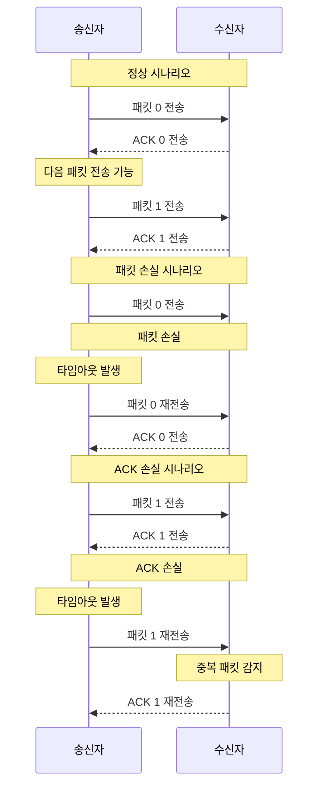
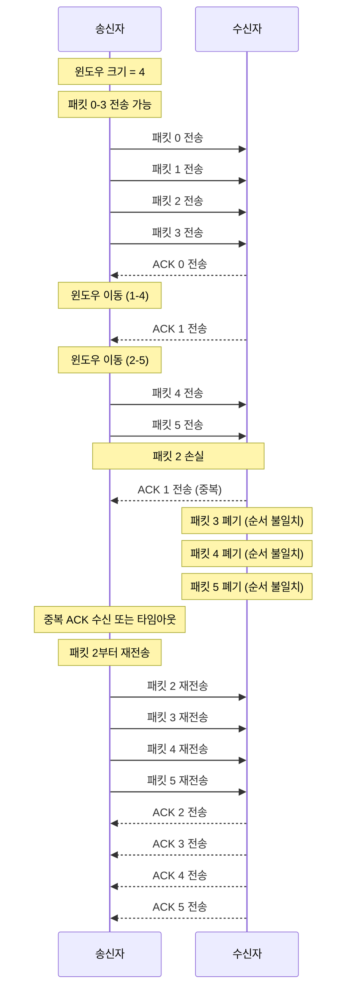
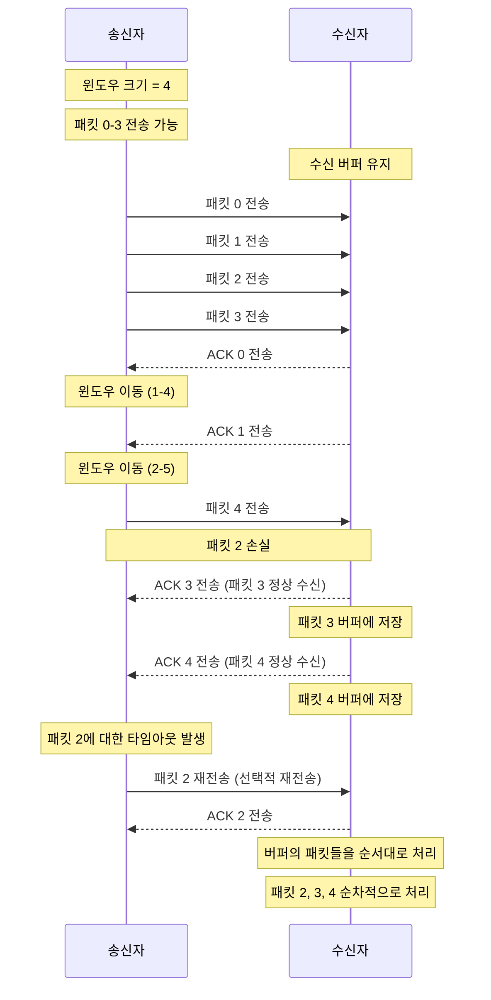
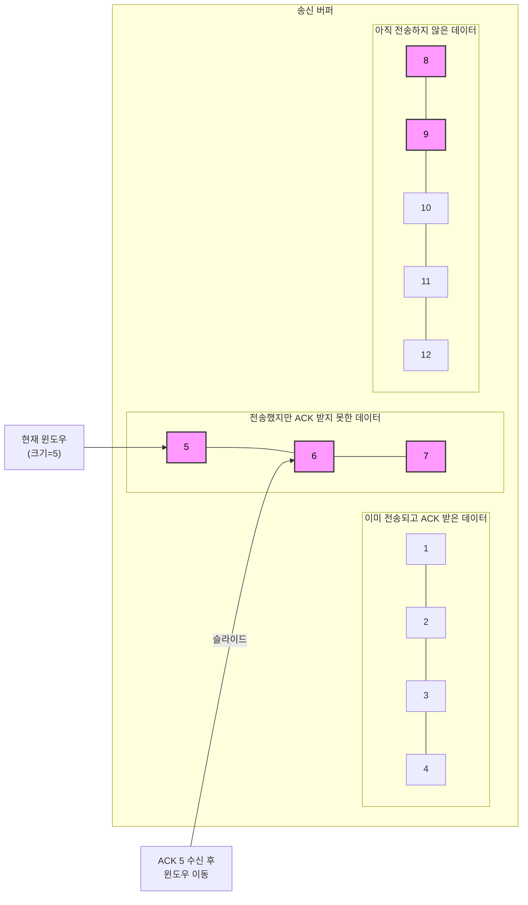
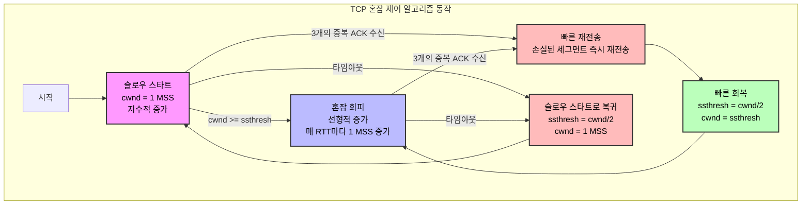
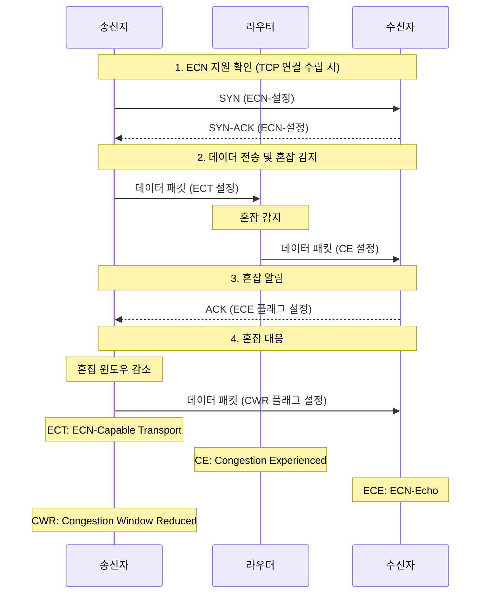

# Chapter 04 전송 계층

## 04-3 TCP의 오류·흐름·혼잡 제어

### 개요

이 장에서는 TCP가 신뢰성 있는 데이터 전송을 보장하기 위해 사용하는 세 가지 핵심 제어 메커니즘인 오류 제어, 흐름 제어, 혼잡 제어에 대해 알아봅니다. 이러한 메커니즘들이 어떻게 작동하는지 이해함으로써 TCP가
인터넷과 같은 불안정한 네트워크 환경에서도 안정적인 통신을 제공할 수 있는 이유를 파악할 수 있습니다.

### 오류 제어: 재전송 기법

TCP는 데이터 전송 중 발생할 수 있는 오류를 감지하고 복구하기 위한 다양한 메커니즘을 제공합니다. 이러한 메커니즘의 핵심은 오류가 발생한 데이터를 재전송하는 것입니다.

#### 오류 검출과 재전송

TCP는 체크섬(Checksum)을 사용하여 데이터의 무결성을 검사합니다. 수신 측에서 계산한 체크섬이 송신 측에서 보낸 체크섬과 일치하지 않으면, 데이터가 손상되었다고 판단하고 해당 세그먼트를 폐기합니다.

| 필드                    | 크기          | 설명                                 |
|-----------------------|-------------|------------------------------------|
| Source Port           | 16 bits     | 송신 애플리케이션의 포트 번호                   |
| Destination Port      | 16 bits     | 수신 애플리케이션의 포트 번호                   |
| Sequence Number       | 32 bits     | 세그먼트의 첫 번째 데이터 바이트 순서 번호           |
| Acknowledgment Number | 32 bits     | 다음에 수신할 것으로 예상되는 바이트 순서 번호         |
| Data Offset           | 4 bits      | TCP 헤더의 크기(32비트 워드 단위)             |
| Reserved              | 6 bits      | 미래 사용을 위해 예약됨(모두 0으로 설정)           |
| Control Bits          | 6 bits      | URG, ACK, PSH, RST, SYN, FIN 플래그   |
| Window Size           | 16 bits     | 수신 윈도우 크기(바이트 단위)                  |
| **Checksum**          | **16 bits** | **헤더와 데이터를 포함한 전체 세그먼트의 무결성 검사**   |
| Urgent Pointer        | 16 bits     | URG 플래그가 설정된 경우 긴급 데이터의 마지막 바이트 위치 |
| Options               | variable    | 추가 옵션(패딩 포함)                       |

> **체크섬(Checksum)**: TCP 헤더와 데이터를 포함한 전체 세그먼트의 무결성을 검사하는 데 사용됩니다. 수신 측에서 계산한 체크섬이 송신 측에서 보낸 체크섬과 일치하지 않으면, 데이터가 손상되었다고
> 판단하고 해당 세그먼트를 폐기합니다.

TCP는 다음과 같은 상황에서 데이터를 재전송합니다:

1. **타임아웃 발생**: 송신 측이 데이터를 보낸 후 일정 시간(RTO, Retransmission Timeout) 내에 확인 응답(ACK)을 받지 못한 경우
2. **중복 ACK 수신**: 동일한 ACK가 여러 번 수신되는 경우(일반적으로 3번)

#### ARQ: 재전송 기법

ARQ(Automatic Repeat reQuest)는 오류 제어를 위한 재전송 프로토콜입니다. TCP에서는 다음과 같은 ARQ 기법들이 사용됩니다:

#### Stop-and-Wait ARQ

가장 기본적인 형태의 ARQ로, 송신자가 하나의 패킷을 보내고 확인 응답을 받을 때까지 기다리는 방식입니다.

**작동 방식**:

1. 송신자가 하나의 패킷을 전송합니다.
2. 송신자는 다음 패킷을 보내기 전에 수신자로부터의 확인 응답(ACK)을 기다립니다.
3. 타임아웃이 발생하거나 부정 응답(NAK)을 받으면 패킷을 재전송합니다.

**장점**: 구현이 간단합니다.
**단점**: 매번 확인 응답을 기다려야 하므로 효율성이 낮습니다.

#### Go-Back-N ARQ

송신자가 여러 패킷을 연속으로 전송할 수 있지만, 오류가 발생하면 해당 패킷부터 모든 후속 패킷을 재전송하는 방식입니다.

**작동 방식**:

1. 송신자는 윈도우 크기(N) 내에서 여러 패킷을 연속으로 전송할 수 있습니다.
2. 수신자는 순서대로 패킷을 받아야 하며, 예상 순서 번호와 다른 패킷이 도착하면 폐기합니다.
3. 오류가 발생하면 송신자는 오류가 발생한 패킷부터 모든 후속 패킷을 재전송합니다.

**장점**: Stop-and-Wait보다 효율적입니다.
**단점**: 하나의 패킷 오류로 인해 여러 패킷을 재전송해야 할 수 있습니다.

#### Selective Repeat ARQ

오류가 발생한 패킷만 선택적으로 재전송하는 방식으로, Go-Back-N의 단점을 보완합니다.

**작동 방식**:

1. 송신자는 윈도우 크기 내에서 여러 패킷을 연속으로 전송할 수 있습니다.
2. 수신자는 정상적으로 수신한 패킷에 대해 개별적으로 ACK를 보냅니다.
3. 송신자는 ACK를 받지 못한 패킷만 선택적으로 재전송합니다.

**장점**: 필요한 패킷만 재전송하므로 효율적입니다.
**단점**: 구현이 복잡하고, 수신자 측에서 버퍼링이 필요합니다.

### 흐름 제어: 슬라이딩 윈도우

흐름 제어는 송신자가 수신자의 처리 능력을 초과하는 속도로 데이터를 전송하는 것을 방지하는 메커니즘입니다. TCP는 슬라이딩 윈도우(Sliding Window) 알고리즘을 사용하여 흐름 제어를 구현합니다.

#### 슬라이딩 윈도우의 개념

슬라이딩 윈도우는 한 번에 전송할 수 있는 데이터의 양을 제한하는 윈도우를 사용합니다. 이 윈도우는 확인 응답을 받으면 앞으로 이동(슬라이드)합니다.

#### TCP의 흐름 제어 구현

TCP 헤더의 '윈도우 크기' 필드를 통해 수신자는 자신이 처리할 수 있는 데이터의 양을 송신자에게 알립니다.

**작동 방식**:

1. 수신자는 TCP 헤더의 윈도우 크기 필드를 통해 수신 가능한 바이트 수를 알립니다.
2. 송신자는 이 윈도우 크기를 초과하지 않는 범위 내에서 데이터를 전송합니다.
3. 수신자가 데이터를 처리하면 윈도우가 슬라이드되고, 새로운 윈도우 크기가 송신자에게 전달됩니다.

**윈도우 크기 조정**:

- 수신자의 버퍼가 거의 차면 윈도우 크기를 줄입니다.
- 버퍼에 여유가 생기면 윈도우 크기를 늘립니다.
- 윈도우 크기가 0이 되면 송신자는 데이터 전송을 일시 중지합니다(Zero Window).

#### 제로 윈도우와 윈도우 프로브

수신자의 윈도우 크기가 0이 되면(제로 윈도우 상태), 송신자는 데이터 전송을 중단합니다. 이후 수신자의 상태를 확인하기 위해 주기적으로 윈도우 프로브(Window Probe) 패킷을 전송합니다.

### 혼잡 제어

혼잡 제어는 네트워크의 혼잡 상태를 감지하고 대응하여 네트워크 성능을 최적화하는 메커니즘입니다. 네트워크 혼잡은 라우터의 버퍼 오버플로우, 패킷 손실, 지연 증가 등의 문제를 일으킵니다.

#### TCP의 혼잡 제어 알고리즘

TCP는 다음과 같은 혼잡 제어 알고리즘을 사용합니다:

1. **슬로우 스타트(Slow Start)**:
    - 연결 초기에 혼잡 윈도우(cwnd)를 1 MSS(Maximum Segment Size)로 설정합니다.
    - 매 RTT(Round Trip Time)마다 혼잡 윈도우를 2배로 증가시킵니다.
    - 혼잡 윈도우가 임계값(ssthresh)에 도달하면 혼잡 회피 단계로 전환합니다.

2. **혼잡 회피(Congestion Avoidance)**:
    - 혼잡 윈도우를 선형적으로 증가시킵니다(매 RTT마다 1 MSS씩 증가).
    - 패킷 손실이 감지되면 임계값을 현재 혼잡 윈도우의 절반으로 설정하고, 혼잡 윈도우를 1 MSS로 재설정한 후 슬로우 스타트를 다시 시작합니다.

3. **빠른 재전송(Fast Retransmit)**:
    - 중복 ACK(일반적으로 3개)를 수신하면 타임아웃을 기다리지 않고 즉시 해당 패킷을 재전송합니다.

4. **빠른 회복(Fast Recovery)**:
    - 빠른 재전송 후, 혼잡 윈도우를 임계값으로 설정하고 혼잡 회피 단계로 진입합니다.
    - 완전히 1 MSS로 줄이지 않고 임계값부터 시작하므로 슬로우 스타트보다 빠르게 회복할 수 있습니다.

#### TCP 혼잡 제어의 변형

다양한 네트워크 환경에 최적화하기 위해 여러 TCP 혼잡 제어 알고리즘이 개발되었습니다:

- **TCP Tahoe**: 원래의 TCP 구현으로, 슬로우 스타트와 혼잡 회피를 포함합니다.
- **TCP Reno**: Tahoe에 빠른 재전송과 빠른 회복을 추가했습니다.
- **TCP NewReno**: Reno의 개선 버전으로, 여러 패킷 손실 상황을 더 효과적으로 처리합니다.
- **TCP CUBIC**: 고속 네트워크에 최적화된 알고리즘으로, 윈도우 크기를 3차 함수로 증가시킵니다.
- **TCP BBR(Bottleneck Bandwidth and RTT)**: 패킷 손실 대신 네트워크 대역폭과 RTT를 기반으로 혼잡을 감지합니다.

### [좀 더 알아보기] ECN: 명시적 혼잡 알림

ECN(Explicit Congestion Notification)은 패킷 손실 없이 네트워크 혼잡을 알리는 메커니즘입니다. 기존의 TCP 혼잡 제어는 패킷 손실을 혼잡의 신호로 사용하지만, ECN은 라우터가 혼잡을
감지했을 때 패킷을 폐기하지 않고 명시적으로 혼잡 상태를 알립니다.

#### ECN의 작동 방식

1. **ECN 지원 확인**: TCP 연결 수립 시 양쪽 호스트가 ECN을 지원하는지 확인합니다.
2. **혼잡 감지**: 라우터는 큐가 특정 임계값을 초과하면 IP 헤더의 ECN 필드를 마킹합니다(CE, Congestion Experienced).
3. **혼잡 알림**: 수신자는 CE 마킹을 감지하면 송신자에게 ECE(ECN-Echo) 플래그를 설정한 ACK를 보냅니다.
4. **혼잡 대응**: 송신자는 ECE를 받으면 혼잡 윈도우를 줄이고, CWR(Congestion Window Reduced) 플래그를 설정하여 응답합니다.

#### ECN의 장점

- 패킷 손실 없이 혼잡을 감지할 수 있어 재전송이 줄어듭니다.
- 지연 시간이 감소하고 처리량이 향상됩니다.
- 특히 실시간 애플리케이션(VoIP, 비디오 스트리밍 등)에 유리합니다.

#### ECN의 한계

- 모든 네트워크 장비와 호스트가 ECN을 지원해야 합니다.
- 일부 방화벽이나 NAT 장비가 ECN 마킹을 제거하거나 ECN 패킷을 차단할 수 있습니다.

### 6가지 키워드로 정리하는 핵심 포인트

1. **오류 제어**: TCP는 체크섬을 통한 오류 검출과 ARQ 기법을 통한 재전송으로 신뢰성 있는 데이터 전송을 보장합니다.

2. **ARQ 기법**: Stop-and-Wait, Go-Back-N, Selective Repeat 등의 재전송 기법을 통해 손실되거나 손상된 데이터를 복구합니다.

3. **슬라이딩 윈도우**: 수신자의 처리 능력에 맞춰 데이터 전송 속도를 조절하는 흐름 제어 메커니즘으로, TCP 헤더의 윈도우 크기 필드를 통해 구현됩니다.

4. **혼잡 제어**: 네트워크의 혼잡 상태를 감지하고 대응하여 네트워크 성능을 최적화하는 메커니즘으로, 슬로우 스타트, 혼잡 회피, 빠른 재전송, 빠른 회복 등의 알고리즘을 사용합니다.

5. **TCP 혼잡 제어 알고리즘**: Tahoe, Reno, NewReno, CUBIC, BBR 등 다양한 네트워크 환경에 최적화된 여러 알고리즘이 개발되었습니다.

6. **ECN**: 패킷 손실 없이 네트워크 혼잡을 명시적으로 알리는 메커니즘으로, 지연 시간 감소와 처리량 향상에 기여합니다.

### 확인 문제

1. TCP의 오류 제어 메커니즘 중 하나인 ARQ에 대한 설명으로 옳지 않은 것은?
    - [ ] Stop-and-Wait ARQ는 매번 확인 응답을 기다려야 하므로 효율성이 낮다.
    - [ ] Go-Back-N ARQ는 오류가 발생한 패킷부터 모든 후속 패킷을 재전송한다.
    - [ ] Selective Repeat ARQ는 오류가 발생한 패킷만 선택적으로 재전송한다.
    - [ ] TCP는 항상 Stop-and-Wait ARQ만 사용한다.

2. TCP의 슬라이딩 윈도우에 대한 설명으로 옳은 것은?
    - [ ] 슬라이딩 윈도우는 오직 혼잡 제어에만 사용된다.
    - [ ] 윈도우 크기는 항상 고정되어 있다.
    - [ ] 수신자는 TCP 헤더의 윈도우 크기 필드를 통해 처리 가능한 데이터 양을 알린다.
    - [ ] 윈도우 크기가 0이 되면 연결이 즉시 종료된다.

3. TCP의 혼잡 제어 알고리즘에 대한 설명으로 옳은 것은?
    - [ ] 슬로우 스타트 단계에서는 혼잡 윈도우가 선형적으로 증가한다.
    - [ ] 혼잡 회피 단계에서는 혼잡 윈도우가 매 RTT마다 1 MSS씩 증가한다.
    - [ ] 빠른 재전송은 타임아웃이 발생한 후에만 수행된다.
    - [ ] 빠른 회복 단계에서는 혼잡 윈도우를 항상 1 MSS로 재설정한다.

4. ECN(Explicit Congestion Notification)에 대한 설명으로 옳지 않은 것은?
    - [ ] ECN은 패킷 손실 없이 네트워크 혼잡을 알리는 메커니즘이다.
    - [ ] ECN을 사용하려면 송신자와 수신자 모두 ECN을 지원해야 한다.
    - [ ] ECN은 IP 헤더의 특정 필드를 사용하여 혼잡 상태를 표시한다.
    - [ ] ECN은 모든 인터넷 라우터에서 기본적으로 활성화되어 있다.

5. 다음 중 TCP의 흐름 제어와 혼잡 제어의 차이점으로 가장 적절한 것은?
    - [ ] 흐름 제어는 송신자 측에서만 구현되고, 혼잡 제어는 수신자 측에서만 구현된다.
    - [ ] 흐름 제어는 수신자의 처리 능력을 고려하고, 혼잡 제어는 네트워크의 혼잡 상태를 고려한다.
    - [ ] 흐름 제어는 패킷 손실 시에만 작동하고, 혼잡 제어는 항상 작동한다.
    - [ ] 흐름 제어는 TCP에서만 사용되고, 혼잡 제어는 UDP에서만 사용된다.

6. TCP의 재전송 타임아웃(RTO)을 결정하는 요소로 가장 중요한 것은?
    - [ ] 송신자의 CPU 성능
    - [ ] 수신자의 윈도우 크기
    - [ ] 왕복 시간(RTT)의 평균과 변동성
    - [ ] 네트워크 인터페이스 카드의 속도

> [정답 및 해설 보기](../answers_and_explanations.md#04-3-tcp의-오류·흐름·혼잡-제어)
