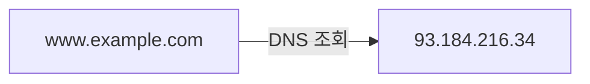
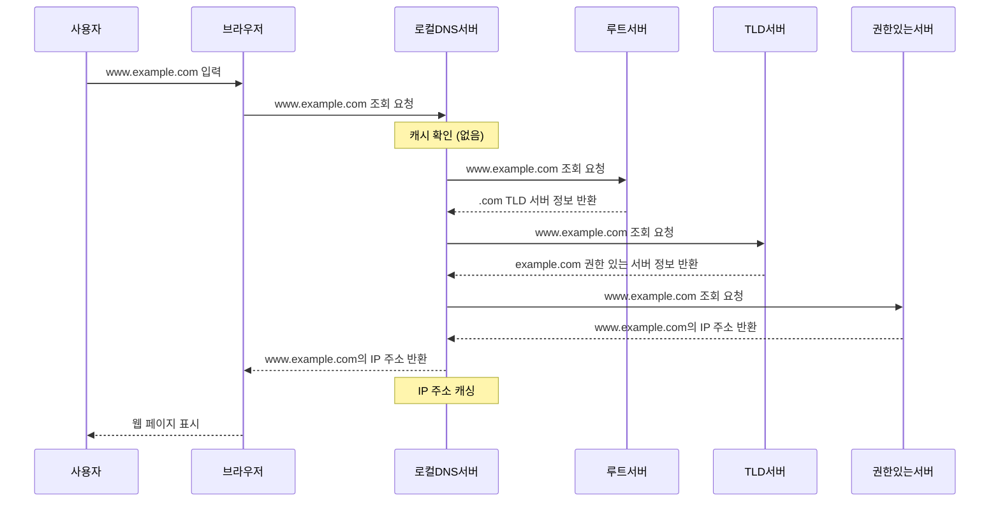
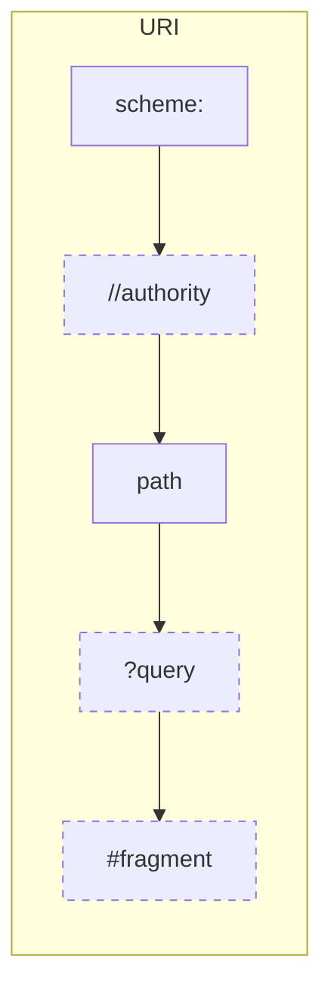
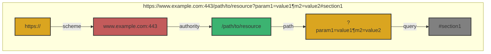

# Chapter 05 응용 계층

## 05-1 DNS와 자원

### 개요
이 장에서는 인터넷에서 도메인 이름과 IP 주소를 매핑하는 DNS(Domain Name System)의 개념과 작동 원리에 대해 알아봅니다. 또한 웹에서 자원을 식별하는 URI(Uniform Resource Identifier)의 구조와 종류에 대해 학습합니다. 이를 통해 웹 개발자로서 인터넷 자원을 효율적으로 활용하고 관리하는 방법을 이해할 수 있습니다.

### 도메인 네임과 네임 서버

인터넷에서 컴퓨터는 IP 주소를 통해 서로를 식별합니다. 그러나 사람이 IP 주소를 기억하기는 어렵습니다. 이러한 문제를 해결하기 위해 도메인 네임 시스템(DNS)이 개발되었습니다.

#### 도메인 네임 시스템(DNS)의 정의

DNS는 인터넷의 전화번호부와 같은 역할을 합니다. 사람이 이해하기 쉬운 도메인 이름(예: www.example.com)을 컴퓨터가 이해할 수 있는 IP 주소(예: 93.184.216.34)로 변환해주는 시스템입니다.



#### DNS 작동 원리

DNS 조회 과정은 다음과 같은 단계로 이루어집니다:

1. 사용자가 브라우저에 도메인 이름(www.example.com)을 입력합니다.
2. 브라우저는 먼저 로컬 DNS 캐시를 확인합니다.
3. 캐시에 정보가 없으면, 운영체제의 DNS 리졸버가 설정된 DNS 서버(보통 ISP가 제공)에 쿼리를 보냅니다.
4. DNS 서버는 해당 도메인의 IP 주소를 찾아 브라우저에 반환합니다.
5. 브라우저는 반환된 IP 주소를 사용하여 웹 서버에 연결합니다.

#### 네임 서버의 역할

네임 서버는 도메인 이름과 IP 주소 간의 매핑 정보를 저장하고 관리하는 서버입니다. 주요 역할은 다음과 같습니다:

- 도메인 이름에 대한 IP 주소 정보 제공
- 도메인에 대한 메일 서버 정보 제공
- 하위 도메인에 대한 위임 정보 관리
- 도메인 이름 정보의 캐싱 및 업데이트

### 계층적 네임 서버

DNS는 단일 서버가 모든 도메인 정보를 관리하는 것이 아니라, 계층적 구조로 분산되어 있습니다. 이러한 구조는 시스템의 확장성과 신뢰성을 높여줍니다.

#### DNS 계층 구조

DNS 계층 구조는 다음과 같이 구성됩니다:

1. **루트 네임 서버(Root Name Server)**: DNS 계층 구조의 최상위에 위치하며, 전 세계에 13개의 루트 서버 그룹이 존재합니다. 이들은 TLD 네임 서버의 정보를 관리합니다.

2. **최상위 도메인 네임 서버(TLD Name Server)**: .com, .org, .net과 같은 최상위 도메인을 관리하는 서버입니다. 각 TLD에 대한 권한 있는 네임 서버 정보를 제공합니다.

3. **권한 있는 네임 서버(Authoritative Name Server)**: 특정 도메인(example.com 등)에 대한 실제 DNS 레코드를 관리하는 서버입니다. 도메인 등록 기관이나 호스팅 제공업체가 운영합니다.

4. **로컬 DNS 서버(Local DNS Server)**: ISP나 조직에서 운영하는 DNS 서버로, 사용자의 DNS 쿼리를 처리하고 결과를 캐싱합니다.

#### DNS 조회 과정의 예

example.com의 IP 주소를 찾는 과정을 살펴보겠습니다:



1. 사용자가 브라우저에 "www.example.com"을 입력합니다.
2. 로컬 DNS 서버는 루트 네임 서버에 쿼리를 보냅니다.
3. 루트 서버는 .com TLD 네임 서버의 정보를 반환합니다.
4. 로컬 DNS 서버는 .com TLD 네임 서버에 쿼리를 보냅니다.
5. .com TLD 서버는 example.com의 권한 있는 네임 서버 정보를 반환합니다.
6. 로컬 DNS 서버는 example.com의 권한 있는 네임 서버에 쿼리를 보냅니다.
7. 권한 있는 네임 서버는 www.example.com의 IP 주소를 반환합니다.
8. 로컬 DNS 서버는 이 정보를 사용자에게 전달하고 자체 캐시에 저장합니다.

#### DNS 캐싱과 TTL

DNS 조회 과정은 시간이 소요되므로, 성능 향상을 위해 DNS 정보를 캐싱합니다:

- **TTL(Time To Live)**: DNS 레코드가 캐시에 얼마나 오래 유지될지 결정하는 값입니다.
- **브라우저 DNS 캐시**: 브라우저는 자체적으로 DNS 조회 결과를 캐싱합니다.
- **운영체제 DNS 캐시**: 운영체제 수준에서도 DNS 정보를 캐싱합니다.
- **로컬 DNS 서버 캐시**: ISP의 DNS 서버도 쿼리 결과를 캐싱하여 재사용합니다.

### 자원을 식별하는 URI

인터넷에서 자원을 고유하게 식별하기 위해 URI(Uniform Resource Identifier)를 사용합니다. URI는 인터넷 상의 자원을 식별하는 통일된 방식을 제공합니다.

#### URI의 정의와 구성 요소

URI는 인터넷 상의 자원을 식별하는 문자열입니다. URI의 일반적인 구문은 다음과 같습니다:



주요 구성 요소:
- **scheme**: 사용할 프로토콜(http, https, ftp 등)
- **authority**: 일반적으로 호스트 이름(도메인)과 포트 번호
- **path**: 서버 내에서 자원의 경로
- **query**: 자원에 전달할 매개변수
- **fragment**: 자원 내의 특정 부분을 가리키는 식별자

#### URL

URL(Uniform Resource Locator)은 URI의 가장 일반적인 형태로, 자원의 위치를 지정합니다. 웹 주소라고도 불립니다.

예시:


위 URL의 구성 요소:
- scheme: https
- authority: www.example.com:443
- path: /path/to/resource
- query: param1=value1&param2=value2
- fragment: section1

웹 개발자는 URL 구조를 이해하고 설계하는 것이 중요합니다. RESTful API 설계 시 URL 경로와 쿼리 매개변수를 어떻게 구성할지 결정해야 합니다.

```javascript
// URL 파싱 예제
const url = new URL('https://www.example.com/search?q=network&page=1');
console.log(url.hostname); // www.example.com
console.log(url.pathname); // /search
console.log(url.searchParams.get('q')); // network
```

#### URN

URN(Uniform Resource Name)은 자원의 이름을 통해 자원을 식별합니다. URL과 달리 자원의 위치에 의존하지 않고, 영구적인 식별자를 제공합니다.

예시:
```
urn:isbn:0451450523
urn:uuid:6e8bc430-9c3a-11d9-9669-0800200c9a66
```

URN은 자원의 위치가 변경되더라도 동일한 식별자를 유지할 수 있다는 장점이 있습니다. 그러나 URL에 비해 실제 사용 빈도는 낮습니다.

### [좀 더 알아보기] DNS 레코드 타입

DNS는 다양한 유형의 레코드를 지원하여 도메인에 대한 다양한 정보를 제공합니다.

#### 주요 DNS 레코드 타입

1. **A 레코드(Address Record)**: 도메인 이름을 IPv4 주소에 매핑합니다.
   ```
   example.com.    IN    A    93.184.216.34
   ```

2. **AAAA 레코드(IPv6 Address Record)**: 도메인 이름을 IPv6 주소에 매핑합니다.
   ```
   example.com.    IN    AAAA    2606:2800:220:1:248:1893:25c8:1946
   ```

3. **CNAME 레코드(Canonical Name)**: 도메인의 별칭을 설정합니다.
   ```
   www.example.com.    IN    CNAME    example.com.
   ```

4. **MX 레코드(Mail Exchange)**: 도메인의 메일 서버를 지정합니다.
   ```
   example.com.    IN    MX    10    mail.example.com.
   ```

5. **NS 레코드(Name Server)**: 도메인의 네임 서버를 지정합니다.
   ```
   example.com.    IN    NS    ns1.example.com.
   ```

6. **TXT 레코드(Text)**: 도메인에 대한 텍스트 정보를 저장합니다. SPF, DKIM 등의 이메일 인증에 사용됩니다.
   ```
   example.com.    IN    TXT    "v=spf1 include:_spf.example.com ~all"
   ```

7. **SOA 레코드(Start of Authority)**: 도메인의 권한 정보와 기타 DNS 설정을 포함합니다.
   ```
   example.com.    IN    SOA    ns1.example.com. admin.example.com. (
                                2023042001 ; 시리얼
                                3600       ; 새로고침
                                1800       ; 재시도
                                604800     ; 만료
                                86400 )    ; 최소 TTL
   ```

#### DNS 레코드 관리의 중요성

웹 개발자는 다음과 같은 이유로 DNS 레코드 관리에 대한 이해가 필요합니다:

- 웹 서버 설정: A 레코드나 CNAME 레코드를 통해 웹 서버 IP 주소 설정
- 이메일 서비스 구성: MX 레코드를 통한 메일 서버 설정
- 도메인 소유권 확인: TXT 레코드를 통한 도메인 소유권 증명
- CDN 설정: CNAME 레코드를 통한 CDN 서비스 연결
- 서비스 마이그레이션: DNS 레코드 변경을 통한 서비스 이전

### 7가지 키워드로 정리하는 핵심 포인트
1. **DNS(Domain Name System)**: 사람이 이해하기 쉬운 도메인 이름을 컴퓨터가 이해할 수 있는 IP 주소로 변환해주는 인터넷의 전화번호부 시스템입니다.

2. **도메인 네임**: 인터넷 상의 컴퓨터나 네트워크 자원을 식별하는 사람이 읽을 수 있는 주소로, IP 주소보다 기억하기 쉽습니다.

3. **네임 서버**: 도메인 이름과 IP 주소 간의 매핑 정보를 저장하고 관리하는 서버로, DNS 쿼리에 응답하는 역할을 합니다.

4. **계층적 DNS 구조**: 루트 서버, TLD 서버, 권한 있는 서버, 로컬 DNS 서버로 구성된 분산 데이터베이스 구조로, 확장성과 신뢰성을 제공합니다.

5. **URI(Uniform Resource Identifier)**: 인터넷 상의 자원을 고유하게 식별하는 문자열로, URL과 URN을 포함하는 상위 개념입니다.

6. **URL(Uniform Resource Locator)**: 웹 주소라고도 불리며, 인터넷 상의 자원 위치를 지정하는 URI의 가장 일반적인 형태입니다.

7. **DNS 레코드**: 도메인에 대한 다양한 정보(IP 주소, 메일 서버, 네임 서버 등)를 저장하는 데이터 항목으로, A, AAAA, CNAME, MX, NS, TXT, SOA 등 다양한 유형이 있습니다.

### 확인 문제
1. DNS의 주요 기능은 무엇인가요?
   - [ ] 웹 페이지의 내용을 저장하는 것
   - [ ] 인터넷 트래픽을 제어하는 것
   - [ ] 도메인 이름을 IP 주소로 변환하는 것
   - [ ] 웹 서버의 성능을 모니터링하는 것

2. 다음 중 DNS 계층 구조에 포함되지 않는 것은?
   - [ ] 루트 네임 서버
   - [ ] TLD 네임 서버
   - [ ] 권한 있는 네임 서버
   - [ ] 프록시 네임 서버

3. URL의 구성 요소가 아닌 것은?
   - [ ] 스킴(scheme)
   - [ ] 경로(path)
   - [ ] 쿼리(query)
   - [ ] 메타데이터(metadata)

4. example.com의 IP 주소를 찾기 위한 DNS 조회 과정의 올바른 순서는?
   - [ ] 권한 있는 네임 서버 → TLD 네임 서버 → 루트 네임 서버 → 로컬 DNS 서버
   - [ ] 로컬 DNS 서버 → 루트 네임 서버 → TLD 네임 서버 → 권한 있는 네임 서버
   - [ ] 로컬 DNS 서버 → 권한 있는 네임 서버 → TLD 네임 서버 → 루트 네임 서버
   - [ ] TLD 네임 서버 → 루트 네임 서버 → 권한 있는 네임 서버 → 로컬 DNS 서버

5. 다음 중 이메일 서버를 지정하는 DNS 레코드 타입은?
   - [ ] A 레코드
   - [ ] CNAME 레코드
   - [ ] MX 레코드
   - [ ] TXT 레코드

6. URI와 URL의 관계를 올바르게 설명한 것은?
   - [ ] URI와 URL은 동일한 개념이다
   - [ ] URL은 URI의 한 종류이다
   - [ ] URI는 URL의 한 종류이다
   - [ ] URI와 URL은 서로 독립적인 개념이다

7. DNS 캐싱의 주요 목적은 무엇인가요?
   - [ ] 도메인 이름의 보안을 강화하기 위해
   - [ ] 더 많은 도메인 이름을 저장하기 위해
   - [ ] DNS 조회 성능을 향상시키기 위해
   - [ ] 인터넷 대역폭을 절약하기 위해

> [정답 및 해설 보기](../answers_and_explanations.md#05-1-DNS와-자원)
