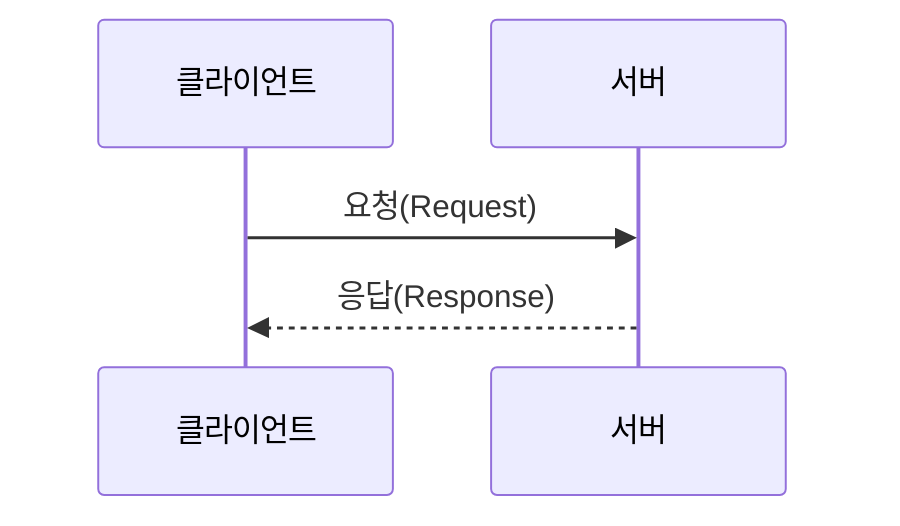
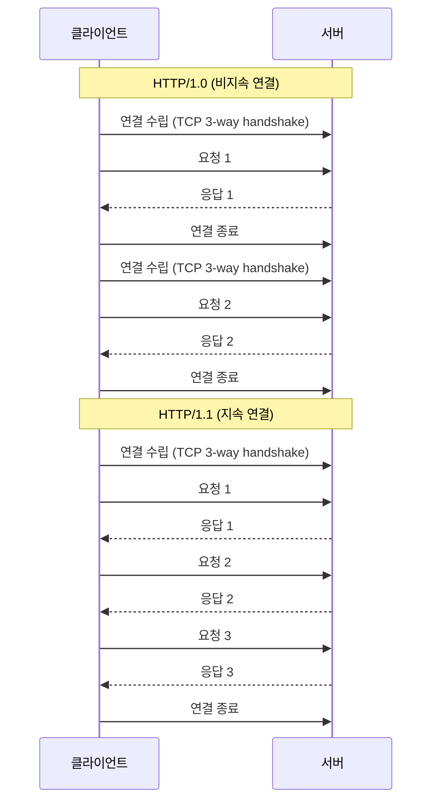
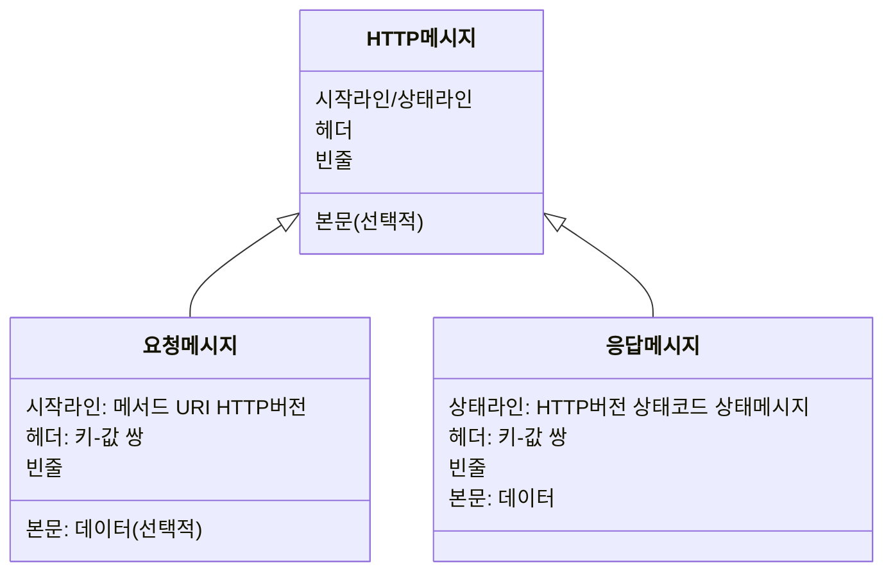
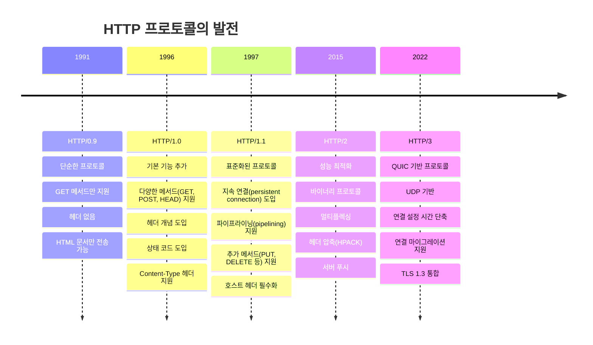

# Chapter 05 응용 계층

## 05-2 HTTP

### 개요
이 장에서는 웹의 기반이 되는 HTTP(Hypertext Transfer Protocol)의 특성과 작동 원리에 대해 알아봅니다. HTTP 메시지의 구조, 다양한 HTTP 메서드, 상태 코드 등을 학습하고, HTTP의 발전 과정도 살펴봅니다. 이를 통해 웹 개발자로서 HTTP 프로토콜을 효과적으로 활용하는 방법을 이해할 수 있습니다.

### HTTP의 특성

HTTP는 웹에서 클라이언트와 서버 간의 통신을 위한 프로토콜로, 다음과 같은 주요 특성을 가지고 있습니다.

#### 요청-응답 기반 프로토콜

HTTP는 클라이언트가 서버에 요청(request)을 보내고, 서버가 이에 대한 응답(response)을 반환하는 요청-응답 모델을 기반으로 합니다.



이 모델에서 클라이언트는 항상 통신을 시작하는 주체이며, 서버는 클라이언트의 요청에 응답하는 역할을 합니다. 서버가 클라이언트에게 먼저 데이터를 보낼 수 없습니다(WebSocket과 같은 다른 프로토콜을 사용하지 않는 한).

#### 미디어 독립적 프로토콜

HTTP는 어떤 종류의 데이터도 전송할 수 있는 미디어 독립적 프로토콜입니다. 텍스트, 이미지, 비디오, 오디오, PDF 등 다양한 형식의 데이터를 전송할 수 있습니다.

이를 위해 HTTP는 Content-Type 헤더를 사용하여 전송되는 데이터의 형식을 명시합니다:

```
Content-Type: text/html; charset=UTF-8
Content-Type: image/jpeg
Content-Type: application/json
```

이러한 특성 덕분에 HTTP는 웹에서 다양한 종류의 콘텐츠를 제공하는 데 적합합니다.

#### 스테이트리스 프로토콜

HTTP는 기본적으로 스테이트리스(stateless) 프로토콜입니다. 즉, 각 요청은 독립적이며 이전 요청과의 관계를 유지하지 않습니다. 서버는 클라이언트의 상태를 저장하지 않으며, 각 요청을 완전히 새로운 요청으로 처리합니다.

이러한 특성은 서버의 확장성을 높이지만, 사용자 세션과 같은 상태 정보가 필요한 웹 애플리케이션에서는 제약이 될 수 있습니다. 이 제약을 극복하기 위해 쿠키, 세션, 토큰 등의 메커니즘이 도입되었습니다.

```javascript
// 스테이트리스 특성으로 인해 각 요청에 인증 정보를 포함해야 함
fetch('https://api.example.com/data', {
  headers: {
    'Authorization': 'Bearer token123'
  }
});
```

#### 지속 연결 프로토콜

초기 HTTP/1.0에서는 각 요청마다 새로운 TCP 연결을 열고 닫았습니다. 이는 성능 저하의 원인이 되었습니다. HTTP/1.1부터는 지속 연결(persistent connection)이 도입되어 하나의 TCP 연결로 여러 요청과 응답을 처리할 수 있게 되었습니다.



지속 연결은 Connection 헤더를 통해 제어할 수 있습니다:

```
Connection: keep-alive  // 지속 연결 유지
Connection: close       // 응답 후 연결 종료
```

### HTTP 메시지 구조

HTTP 통신은 메시지 교환을 통해 이루어집니다. HTTP 메시지는 요청 메시지와 응답 메시지로 구분되며, 각각 다음과 같은 구조를 가집니다.



#### 요청 메시지 구조

HTTP 요청 메시지는 다음과 같은 구성 요소로 이루어집니다:

1. **시작 라인(Start Line)**: 요청의 첫 줄로, HTTP 메서드, 요청 URI, HTTP 버전을 포함합니다.
   ```
   GET /index.html HTTP/1.1
   ```

2. **헤더(Headers)**: 요청에 대한 추가 정보를 제공하는 키-값 쌍입니다.
   ```
   Host: www.example.com
   User-Agent: Mozilla/5.0
   Accept: text/html
   ```

3. **빈 줄(Empty Line)**: 헤더와 본문을 구분하는 빈 줄입니다.

4. **본문(Body)**: 요청과 함께 전송되는 데이터입니다. GET 요청에서는 일반적으로 비어 있으며, POST 요청에서는 폼 데이터나 JSON 등이 포함될 수 있습니다.
   ```
   {
     "username": "user1",
     "email": "user1@example.com"
   }
   ```

#### 응답 메시지 구조

HTTP 응답 메시지는 다음과 같은 구성 요소로 이루어집니다:

1. **상태 라인(Status Line)**: 응답의 첫 줄로, HTTP 버전, 상태 코드, 상태 메시지를 포함합니다.
   ```
   HTTP/1.1 200 OK
   ```

2. **헤더(Headers)**: 응답에 대한 추가 정보를 제공하는 키-값 쌍입니다.
   ```
   Content-Type: text/html; charset=UTF-8
   Content-Length: 1234
   Server: nginx/1.14.0
   ```

3. **빈 줄(Empty Line)**: 헤더와 본문을 구분하는 빈 줄입니다.

4. **본문(Body)**: 응답으로 전송되는 데이터입니다. HTML 문서, JSON 데이터, 이미지 등이 포함될 수 있습니다.
   ```html
   <!DOCTYPE html>
   <html>
   <head>
     <title>Example Page</title>
   </head>
   <body>
     <h1>Hello, World!</h1>
   </body>
   </html>
   ```

### HTTP 메서드

HTTP 메서드는 클라이언트가 서버에 요청하는 작업의 종류를 나타냅니다. 각 메서드는 서로 다른 의미와 용도를 가지고 있습니다.

#### GET - 가져다주세요

GET 메서드는 지정된 리소스의 표현을 요청합니다. GET 요청은 데이터를 조회하는 용도로만 사용해야 하며, 서버의 상태를 변경해서는 안 됩니다.

```
GET /users/123 HTTP/1.1
Host: api.example.com
```

GET 요청의 특징:
- URL에 쿼리 매개변수를 포함할 수 있습니다: `/search?q=network&page=1`
- 요청 본문을 가지지 않습니다(일부 API에서는 예외적으로 사용하기도 함)
- 브라우저 히스토리에 남습니다
- 북마크할 수 있습니다
- 캐시될 수 있습니다
- 데이터 길이에 제한이 있습니다(URL 길이 제한)

#### HEAD - 헤더만 가져다주세요

HEAD 메서드는 GET 메서드와 동일하지만, 서버는 응답 본문 없이 헤더만 반환합니다. 이는 리소스의 메타데이터만 확인하거나, 리소스가 존재하는지 확인할 때 유용합니다.

```
HEAD /large-file.zip HTTP/1.1
Host: downloads.example.com
```

HEAD 요청은 다음과 같은 용도로 사용됩니다:
- 리소스가 수정되었는지 확인(Last-Modified 헤더)
- 리소스의 크기 확인(Content-Length 헤더)
- 서버 상태 확인

#### POST - 처리해 주세요

POST 메서드는 서버에 데이터를 제출하여 새 리소스를 생성하거나 기존 리소스를 수정하는 데 사용됩니다.

```
POST /users HTTP/1.1
Host: api.example.com
Content-Type: application/json

{
  "name": "John Doe",
  "email": "john@example.com"
}
```

POST 요청의 특징:
- 요청 본문에 데이터를 포함합니다
- 브라우저 히스토리에 남지 않습니다
- 북마크할 수 없습니다
- 캐시되지 않습니다
- 데이터 길이에 제한이 없습니다

#### PUT - 덮어써 주세요

PUT 메서드는 지정된 리소스를 요청 본문의 내용으로 완전히 대체합니다. 리소스가 존재하지 않으면 새로 생성합니다.

```
PUT /users/123 HTTP/1.1
Host: api.example.com
Content-Type: application/json

{
  "name": "John Smith",
  "email": "john.smith@example.com"
}
```

PUT 요청의 특징:
- 멱등성(idempotent): 동일한 요청을 여러 번 수행해도 결과가 같습니다
- 리소스의 전체 상태를 대체합니다
- 부분 업데이트에는 적합하지 않습니다

#### PATCH - 일부 수정해 주세요

PATCH 메서드는 리소스의 일부만 수정하는 데 사용됩니다. PUT과 달리 전체 리소스를 대체하지 않고 지정된 변경 사항만 적용합니다.

```
PATCH /users/123 HTTP/1.1
Host: api.example.com
Content-Type: application/json

{
  "email": "new.email@example.com"
}
```

PATCH 요청의 특징:
- 리소스의 일부만 업데이트합니다
- 일반적으로 멱등성을 보장하지 않습니다(구현에 따라 다를 수 있음)
- 변경 사항만 전송하므로 네트워크 대역폭을 절약할 수 있습니다

#### DELETE - 삭제해 주세요

DELETE 메서드는 지정된 리소스를 삭제하는 데 사용됩니다.

```
DELETE /users/123 HTTP/1.1
Host: api.example.com
```

DELETE 요청의 특징:
- 멱등성: 동일한 요청을 여러 번 수행해도 결과가 같습니다(첫 번째 요청 후 리소스가 이미 삭제됨)
- 요청 본문이 없거나 있을 수 있습니다(구현에 따라 다름)
- 성공적인 응답은 일반적으로 204 No Content 또는 200 OK입니다

### HTTP 상태 코드

HTTP 상태 코드는 서버가 클라이언트의 요청을 처리한 결과를 나타냅니다. 상태 코드는 세 자리 숫자로 구성되며, 첫 번째 숫자에 따라 다섯 가지 클래스로 분류됩니다.

#### 200번대: 성공 상태 코드

200번대 상태 코드는 요청이 성공적으로 처리되었음을 나타냅니다.

- **200 OK**: 요청이 성공적으로 처리되었습니다.
  ```
  HTTP/1.1 200 OK
  Content-Type: application/json

  {"status": "success", "data": {...}}
  ```

- **201 Created**: 요청이 성공적으로 처리되어 새 리소스가 생성되었습니다.
  ```
  HTTP/1.1 201 Created
  Location: /users/123
  Content-Type: application/json

  {"id": 123, "name": "John Doe"}
  ```

- **204 No Content**: 요청이 성공적으로 처리되었지만, 응답 본문이 없습니다.
  ```
  HTTP/1.1 204 No Content
  ```

#### 300번대: 리다이렉션 상태 코드

300번대 상태 코드는 클라이언트가 요청을 완료하기 위해 추가 작업이 필요함을 나타냅니다.

- **301 Moved Permanently**: 요청한 리소스가 영구적으로 새 위치로 이동했습니다.
  ```
  HTTP/1.1 301 Moved Permanently
  Location: https://www.example.com/new-page
  ```

- **302 Found**: 요청한 리소스가 일시적으로 새 위치에 있습니다.
  ```
  HTTP/1.1 302 Found
  Location: https://www.example.com/temporary-page
  ```

- **304 Not Modified**: 클라이언트의 캐시된 버전이 여전히 유효합니다.
  ```
  HTTP/1.1 304 Not Modified
  ETag: "33a64df551425fcc55e4d42a148795d9f25f89d4"
  ```

#### 400번대: 클라이언트 에러 상태 코드

400번대 상태 코드는 클라이언트의 요청에 오류가 있음을 나타냅니다.

- **400 Bad Request**: 서버가 요청을 이해할 수 없거나 잘못된 요청입니다.
  ```
  HTTP/1.1 400 Bad Request
  Content-Type: application/json

  {"error": "Invalid request parameters"}
  ```

- **401 Unauthorized**: 인증이 필요한 리소스에 인증 없이 접근했습니다.
  ```
  HTTP/1.1 401 Unauthorized
  WWW-Authenticate: Basic realm="Access to the API"
  ```

- **403 Forbidden**: 서버가 요청을 이해했지만 권한이 없어 거부했습니다.
  ```
  HTTP/1.1 403 Forbidden
  Content-Type: application/json

  {"error": "You don't have permission to access this resource"}
  ```

- **404 Not Found**: 요청한 리소스를 찾을 수 없습니다.
  ```
  HTTP/1.1 404 Not Found
  Content-Type: application/json

  {"error": "Resource not found"}
  ```

- **429 Too Many Requests**: 클라이언트가 지정된 시간 내에 너무 많은 요청을 보냈습니다.
  ```
  HTTP/1.1 429 Too Many Requests
  Retry-After: 60
  ```

#### 500번대: 서버 에러 상태 코드

500번대 상태 코드는 서버에서 오류가 발생했음을 나타냅니다.

- **500 Internal Server Error**: 서버에서 처리 중 예상치 못한 오류가 발생했습니다.
  ```
  HTTP/1.1 500 Internal Server Error
  Content-Type: application/json

  {"error": "An unexpected error occurred"}
  ```

- **502 Bad Gateway**: 게이트웨이 또는 프록시 서버가 업스트림 서버로부터 잘못된 응답을 받았습니다.
  ```
  HTTP/1.1 502 Bad Gateway
  ```

- **503 Service Unavailable**: 서버가 일시적으로 요청을 처리할 수 없습니다.
  ```
  HTTP/1.1 503 Service Unavailable
  Retry-After: 120
  ```

- **504 Gateway Timeout**: 게이트웨이 또는 프록시 서버가 업스트림 서버로부터 응답을 기다리다 시간 초과가 발생했습니다.
  ```
  HTTP/1.1 504 Gateway Timeout
  ```

### [좀 더 알아보기] HTTP의 발전: HTTP/0.9에서 HTTP/3.0까지

HTTP는 웹의 발전과 함께 지속적으로 진화해왔습니다. 각 버전은 이전 버전의 한계를 극복하고 성능과 기능을 개선했습니다.



#### HTTP/0.9 - 단순한 프로토콜

1991년에 등장한 HTTP의 초기 버전으로, 매우 단순했습니다:
- GET 메서드만 지원
- 헤더가 없음
- HTML 문서만 전송 가능
- 각 요청 후 연결 종료

```
GET /index.html

<html>
Simple HTML page
</html>
```

#### HTTP/1.0 - 기본 기능 추가

1996년에 등장한 HTTP/1.0은 다음과 같은 기능을 추가했습니다:
- 다양한 메서드(GET, POST, HEAD) 지원
- 헤더 개념 도입
- 상태 코드 도입
- Content-Type 헤더를 통한 다양한 문서 형식 지원
- 여전히 각 요청마다 새로운 연결 필요

```
GET /index.html HTTP/1.0
User-Agent: NCSA_Mosaic/2.0

HTTP/1.0 200 OK
Content-Type: text/html
Content-Length: 137

<html>
...
</html>
```

#### HTTP/1.1 - 표준화된 프로토콜

1997년에 등장하고 1999년에 개정된 HTTP/1.1은 오랫동안 웹의 표준 프로토콜로 사용되었습니다:
- 지속 연결(persistent connection) 도입
- 파이프라이닝(pipelining) 지원
- 추가 메서드(PUT, DELETE, OPTIONS 등) 지원
- 호스트 헤더 필수화(가상 호스팅 지원)
- 청크 전송 인코딩 지원
- 캐시 제어 메커니즘 개선

```
GET /index.html HTTP/1.1
Host: www.example.com
Connection: keep-alive

HTTP/1.1 200 OK
Content-Type: text/html
Content-Length: 348
Connection: keep-alive

<html>
...
</html>
```

#### HTTP/2 - 성능 최적화

2015년에 표준화된 HTTP/2는 성능 향상에 중점을 두었습니다:
- 바이너리 프로토콜(텍스트 기반에서 바이너리 기반으로 변경)
- 멀티플렉싱(multiplexing): 하나의 연결로 여러 요청과 응답을 동시에 처리
- 헤더 압축(HPACK)
- 서버 푸시: 클라이언트가 요청하기 전에 서버가 리소스를 미리 전송
- 스트림 우선순위 지정
- HTTP/1.1과의 하위 호환성 유지

HTTP/2는 프로토콜 구조가 크게 변경되었지만, 메서드, 상태 코드, 헤더 등의 의미는 HTTP/1.1과 동일하게 유지되었습니다.

#### HTTP/3 - QUIC 기반 프로토콜

2022년에 표준화된 HTTP/3는 TCP 대신 QUIC(Quick UDP Internet Connections)이라는 새로운 전송 프로토콜을 기반으로 합니다:
- UDP 기반 QUIC 프로토콜 사용
- 연결 설정 시간 단축
- 향상된 혼잡 제어
- 연결 마이그레이션 지원(네트워크 변경 시에도 연결 유지)
- 개선된 오류 처리 및 패킷 손실 복구
- TLS 1.3 통합으로 보안 강화

HTTP/3는 HTTP/2의 기능적 특성을 대부분 유지하면서 전송 계층의 성능과 신뢰성을 개선했습니다.

### 4가지 키워드로 정리하는 핵심 포인트
1. **HTTP 특성**: HTTP는 요청-응답 기반, 미디어 독립적, 스테이트리스, 지속 연결 특성을 가진 프로토콜로, 웹에서 클라이언트와 서버 간의 통신을 위한 기본 프로토콜입니다.

2. **HTTP 메시지**: HTTP 통신은 요청 메시지와 응답 메시지로 이루어지며, 각 메시지는 시작 라인(또는 상태 라인), 헤더, 빈 줄, 본문으로 구성됩니다.

3. **HTTP 메서드**: GET, HEAD, POST, PUT, PATCH, DELETE 등의 메서드는 서버에 요청하는 작업의 종류를 나타내며, 각각 리소스 조회, 헤더만 조회, 데이터 제출, 리소스 대체, 리소스 일부 수정, 리소스 삭제 등의 의미를 가집니다.

4. **HTTP 상태 코드**: 서버가 클라이언트의 요청을 처리한 결과를 나타내는 세 자리 숫자로, 200번대(성공), 300번대(리다이렉션), 400번대(클라이언트 오류), 500번대(서버 오류)로 분류됩니다.

### 확인 문제
1. HTTP의 특성으로 옳지 않은 것은?
   - [ ] 요청-응답 기반 프로토콜이다
   - [ ] 미디어 독립적 프로토콜이다
   - [x] 상태 유지(stateful) 프로토콜이다
   - [ ] 지속 연결을 지원한다

2. 다음 중 HTTP 메서드와 그 용도가 올바르게 짝지어진 것은?
   - [ ] GET - 서버에 데이터를 제출하여 새 리소스 생성
   - [x] POST - 서버에 데이터를 제출하여 처리 요청
   - [ ] PUT - 리소스의 일부만 수정
   - [ ] DELETE - 리소스의 메타데이터만 조회

3. HTTP 상태 코드 401과 403의 차이점으로 옳은 것은?
   - [x] 401은 인증 실패, 403은 권한 부족을 의미한다
   - [ ] 401은 리소스 찾을 수 없음, 403은 서버 오류를 의미한다
   - [ ] 401은 일시적 리다이렉션, 403은 영구적 리다이렉션을 의미한다
   - [ ] 401은 클라이언트 오류, 403은 서버 오류를 의미한다

4. HTTP/2의 주요 특징이 아닌 것은?
   - [ ] 헤더 압축
   - [ ] 멀티플렉싱
   - [ ] 서버 푸시
   - [x] UDP 기반 전송 프로토콜

5. HTTP 메시지의 구성 요소를 올바른 순서로 나열한 것은?
   - [x] 시작 라인(또는 상태 라인) → 헤더 → 빈 줄 → 본문
   - [ ] 헤더 → 시작 라인(또는 상태 라인) → 본문 → 빈 줄
   - [ ] 시작 라인(또는 상태 라인) → 본문 → 헤더 → 빈 줄
   - [ ] 헤더 → 빈 줄 → 시작 라인(또는 상태 라인) → 본문

6. 다음 중 멱등성(idempotent)을 가진 HTTP 메서드는?
   - [ ] POST
   - [x] GET
   - [ ] PATCH
   - [ ] 모든 HTTP 메서드

> [정답 및 해설 보기](../answers_and_explanations.md#05-2-http)
