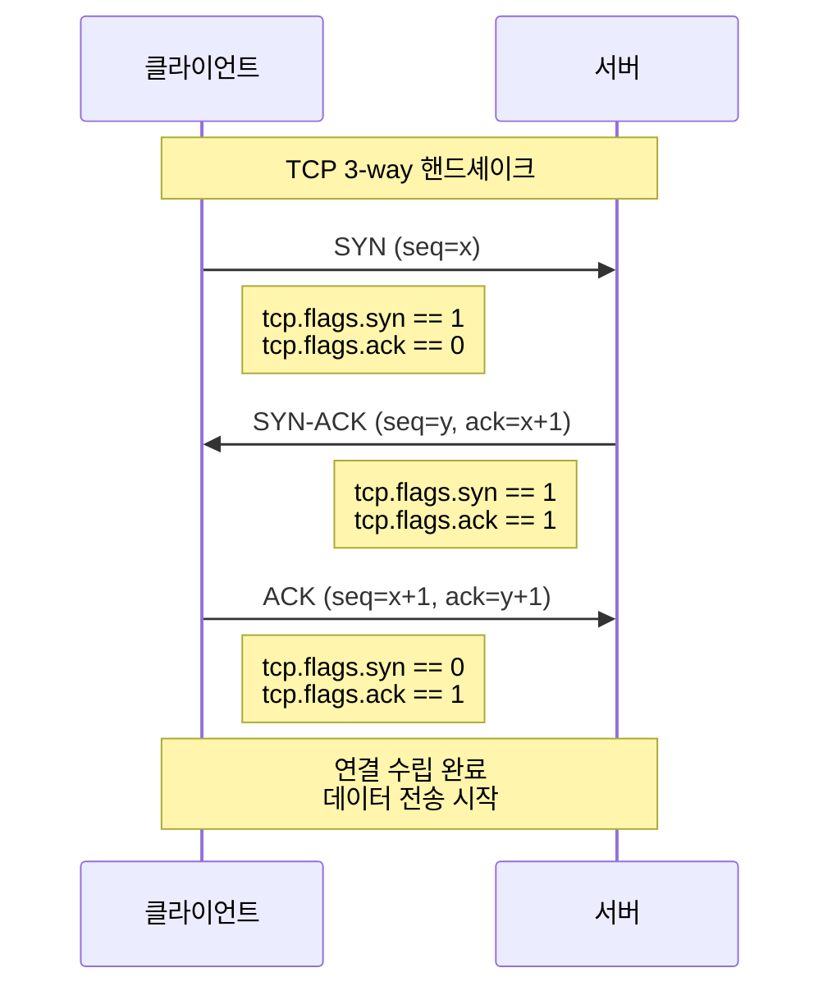
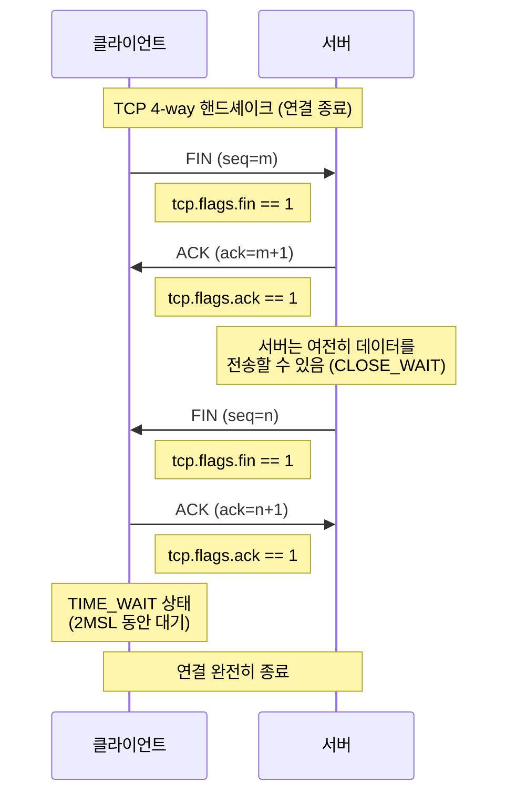

# Chapter 06 실습으로 복습하는 네트워크

## 06-2 와이어샤크를 통한 프로토콜 분석

### 개요

이 섹션에서는 와이어샤크를 사용하여 다양한 네트워크 프로토콜을 분석하는 방법에 대해 알아봅니다. IP, TCP, HTTP 등 주요 프로토콜의 패킷 구조를 실제로 분석하면서 이론적으로 배운 네트워크 개념을 실습을 통해
복습하고 더 깊이 이해할 수 있습니다.

### IP 분석

IP(Internet Protocol)는 네트워크 계층에서 동작하는 프로토콜로, 패킷의 라우팅과 전달을 담당합니다. 와이어샤크를 통해 IPv4와 IPv6 패킷의 구조와 동작을 분석해 보겠습니다.

#### IPv4 단편화 + ICMP

IPv4 패킷이 너무 커서 MTU(Maximum Transmission Unit)를 초과할 경우, 패킷은 여러 개의 작은 조각(fragment)으로 나뉘어 전송됩니다. 이를 단편화(fragmentation)라고
합니다.

1. **IPv4 단편화 관찰하기**:
    - 와이어샤크에서 큰 크기의 ICMP 패킷(예: ping -s 3000 [목적지 IP])을 캡처합니다.
    - 필터: `ip.flags.mf == 1 || ip.frag_offset > 0`

2. **IPv4 헤더 필드 분석**:
    - **Identification**: 같은 패킷에서 분할된 조각들은 동일한 ID 값을 가집니다.
    - **Flags**:
        - More Fragments(MF) 비트: 뒤에 더 많은 조각이 있음을 나타냅니다.
        - Don't Fragment(DF) 비트: 패킷의 단편화를 금지합니다.
    - **Fragment Offset**: 원래 패킷에서 이 조각의 위치를 나타냅니다.

3. **ICMP 분석**:
    - ICMP(Internet Control Message Protocol)는 네트워크 상태 정보를 전달하는 프로토콜입니다.
    - 와이어샤크에서 ICMP 패킷 필터링: `icmp`
    - 주요 ICMP 메시지 유형:
        - Echo Request/Reply (Type 8/0): ping 명령에 사용됩니다.
        - Destination Unreachable (Type 3): 목적지에 도달할 수 없을 때 발생합니다.
        - Time Exceeded (Type 11): TTL이 0이 되었을 때 발생합니다(traceroute에 사용).

#### IPv6 단편화 + UDP

IPv6는 IPv4의 후속 버전으로, 더 큰 주소 공간과 향상된 기능을 제공합니다.

1. **IPv6 패킷 구조 분석**:
    - 와이어샤크에서 IPv6 패킷 필터링: `ipv6`
    - IPv6 헤더는 IPv4보다 단순화되었으며, 확장 헤더를 통해 추가 기능을 제공합니다.

2. **IPv6 단편화 관찰**:
    - IPv6에서는 기본적으로 라우터가 단편화를 수행하지 않습니다.
    - 단편화가 필요한 경우 Fragment 확장 헤더를 사용합니다.
    - 필터: `ipv6.nxt == 44` (Fragment 헤더)

3. **UDP over IPv6 분석**:
    - UDP(User Datagram Protocol)는 비연결형, 비신뢰성 전송 프로토콜입니다.
    - 와이어샤크에서 UDP over IPv6 패킷 필터링: `udp && ipv6`
    - UDP 헤더 분석:
        - Source Port: 출발지 포트
        - Destination Port: 목적지 포트
        - Length: UDP 헤더와 데이터를 포함한 길이
        - Checksum: 오류 검출을 위한 체크섬

### TCP 분석

TCP(Transmission Control Protocol)는 연결 지향적이고 신뢰성 있는 데이터 전송을 제공하는 전송 계층 프로토콜입니다. 와이어샤크를 통해 TCP의 주요 동작을 분석해 보겠습니다.

#### TCP 연결 수립

TCP 연결 수립은 3-way 핸드셰이크 과정을 통해 이루어집니다.

1. **3-way 핸드셰이크 관찰하기**:
    - 웹 브라우저로 웹사이트 접속 시 발생하는 TCP 연결을 캡처합니다.
    - 필터: `tcp.flags.syn == 1 || tcp.flags.ack == 1 && tcp.flags.fin == 0`

2. **핸드셰이크 과정 분석**:
    - **SYN**: 클라이언트가 서버에 연결 요청을 보냅니다. (tcp.flags.syn == 1, tcp.flags.ack == 0)
    - **SYN-ACK**: 서버가 클라이언트의 요청을 수락하고 응답합니다. (tcp.flags.syn == 1, tcp.flags.ack == 1)
    - **ACK**: 클라이언트가 서버의 응답을 확인합니다. (tcp.flags.syn == 0, tcp.flags.ack == 1)

3. **TCP 헤더 필드 분석**:
    - **Sequence Number**: 데이터 스트림에서의 위치를 나타냅니다.
    - **Acknowledgment Number**: 다음에 받기를 기대하는 바이트의 시퀀스 번호입니다.
    - **Window Size**: 수신 버퍼의 크기를 나타냅니다.
    - **Flags**: SYN, ACK, FIN, RST, PSH, URG 등의 제어 비트입니다.

#### TCP 연결 종료

TCP 연결 종료는 일반적으로 4-way 핸드셰이크 과정을 통해 이루어집니다.

1. **4-way 핸드셰이크 관찰하기**:
    - 웹 페이지 로딩 완료 후 발생하는 TCP 연결 종료를 캡처합니다.
    - 필터: `tcp.flags.fin == 1`

2. **종료 과정 분석**:
    - **FIN**: 한 쪽(클라이언트 또는 서버)이 연결 종료를 요청합니다.
    - **ACK**: 상대방이 FIN을 확인합니다.
    - **FIN**: 상대방도 연결 종료를 요청합니다.
    - **ACK**: 마지막 FIN에 대한 확인을 보냅니다.

3. **TCP 상태 변화 추적**:
    - ESTABLISHED → FIN-WAIT-1 → FIN-WAIT-2 → TIME-WAIT → CLOSED (능동적 종료 측)
    - ESTABLISHED → CLOSE-WAIT → LAST-ACK → CLOSED (수동적 종료 측)

#### TCP 재전송

TCP는 신뢰성 있는 데이터 전송을 위해 손실된 패킷을 재전송하는 메커니즘을 가지고 있습니다.

1. **재전송 패킷 관찰하기**:
    - 네트워크 상태가 좋지 않은 환경에서 패킷을 캡처합니다.
    - 와이어샤크의 자동 재전송 감지 기능 활용: 패킷 목록에서 검은색 배경의 패킷
    - 필터: `tcp.analysis.retransmission`

2. **재전송 유형 분석**:
    - **Fast Retransmission**: 중복 ACK를 3개 이상 받으면 타임아웃 전에 재전송합니다.
    - **Timeout Retransmission**: 타임아웃 후 재전송합니다.

3. **TCP 타이머와 재전송 관계**:
    - **RTO(Retransmission Timeout)**: 재전송 타임아웃 값
    - **RTT(Round Trip Time)**: 패킷이 왕복하는 데 걸리는 시간
    - RTO는 RTT를 기반으로 동적으로 조정됩니다.

### HTTP 분석

HTTP(Hypertext Transfer Protocol)는 웹 브라우저와 웹 서버 간의 통신에 사용되는 응용 계층 프로토콜입니다.

1. **HTTP 요청/응답 관찰하기**:
    - 웹 브라우저로 웹사이트 접속 시 발생하는 HTTP 트래픽을 캡처합니다.
    - 필터: `http`

2. **HTTP 요청 분석**:
    - **요청 라인**: 메서드(GET, POST 등), URI, HTTP 버전
    - **헤더**: Host, User-Agent, Accept, Cookie 등
    - **본문**: POST 요청의 경우 폼 데이터 등이 포함됩니다.

3. **HTTP 응답 분석**:
    - **상태 라인**: HTTP 버전, 상태 코드(200, 404 등), 상태 메시지
    - **헤더**: Content-Type, Content-Length, Server 등
    - **본문**: HTML, JSON, 이미지 등의 실제 콘텐츠

4. **HTTP 세션 추적**:
    - 와이어샤크의 "Follow HTTP Stream" 기능을 사용하여 전체 HTTP 대화를 볼 수 있습니다.
    - 패킷을 우클릭하고 "Follow" → "HTTP Stream" 선택

5. **HTTPS 트래픽**:
    - HTTPS는 암호화된 HTTP 트래픽으로, 기본적으로 내용을 볼 수 없습니다.
    - TLS 핸드셰이크 과정은 분석 가능: 필터 `ssl || tls`

### 5가지 키워드로 정리하는 핵심 포인트

1. **패킷 구조 분석**: 와이어샤크를 통해 IP, TCP, HTTP 등 다양한 프로토콜의 패킷 구조를 계층별로 상세히 분석할 수 있으며, 이는 네트워크 동작 원리를 이해하는 데 큰 도움이 됩니다.
2. **IP 단편화**: MTU를 초과하는 큰 패킷은 여러 조각으로 나뉘어 전송되며, 와이어샤크에서 이러한 단편화 과정과 관련 필드(Identification, Flags, Fragment Offset)를 관찰할
   수 있습니다.
3. **TCP 연결 관리**: TCP의 3-way 핸드셰이크(연결 수립), 4-way 핸드셰이크(연결 종료) 과정을 와이어샤크로 캡처하여 TCP 연결의 수립과 종료 메커니즘을 실제로 확인할 수 있습니다.
4. **오류 제어 메커니즘**: TCP의 재전송과 같은 오류 제어 메커니즘을 와이어샤크로 관찰함으로써, 네트워크에서 신뢰성 있는 데이터 전송이 어떻게 이루어지는지 이해할 수 있습니다.
5. **프로토콜 계층 구조**: 와이어샤크의 패킷 상세 창을 통해 네트워크 프로토콜의 계층 구조(이더넷, IP, TCP/UDP, HTTP 등)를 명확히 볼 수 있어, OSI 모델이나 TCP/IP 모델의 추상적
   개념을 구체적으로 이해할 수 있습니다.

### 확인 문제

1. 와이어샤크에서 IPv4 단편화된 패킷을 필터링하기 위한 올바른 표현식은?
    - [ ] ip.fragmentation == 1
    - [ ] ip.fragment == true
    - [ ] ip.flags.mf == 1 || ip.frag_offset > 0
    - [ ] ip.fragment_flag == 1

2. TCP 3-way 핸드셰이크의 두 번째 단계에서 서버가 보내는 패킷의 플래그 조합은?
    - [ ] SYN
    - [ ] SYN-ACK
    - [ ] ACK
    - [ ] FIN-ACK

3. 와이어샤크에서 TCP 재전송 패킷을 필터링하는 표현식은?
    - [ ] tcp.retransmission
    - [ ] tcp.analysis.retransmission
    - [ ] tcp.flags.retransmit == 1
    - [ ] tcp.resend == true

4. HTTP GET 요청과 해당 응답을 포함한 전체 대화를 보기 위해 와이어샤크에서 사용하는 기능은?
    - [ ] View HTTP Headers
    - [ ] Decode HTTP
    - [ ] Follow HTTP Stream
    - [ ] Extract HTTP Objects

5. IPv6에서 패킷 단편화를 위해 사용하는 확장 헤더는?
    - [ ] Hop-by-Hop Options 헤더
    - [ ] Routing 헤더
    - [ ] Fragment 헤더
    - [ ] Destination Options 헤더

> [정답 및 해설 보기](../answers_and_explanations.md#06-2-와이어샤크를-통한-프로토콜-분석)
