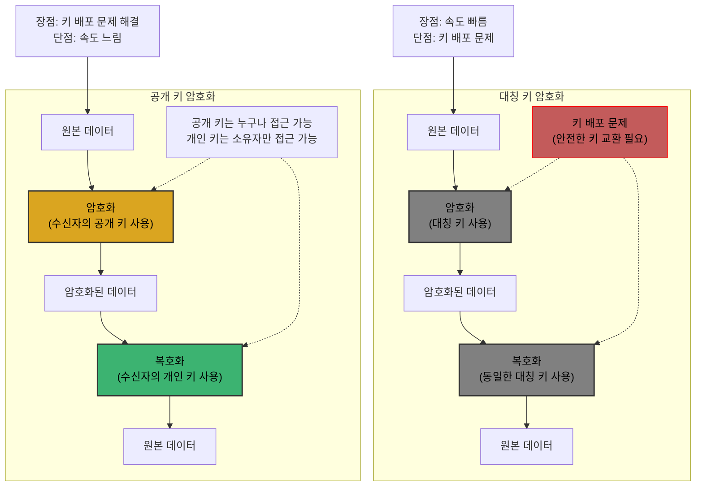
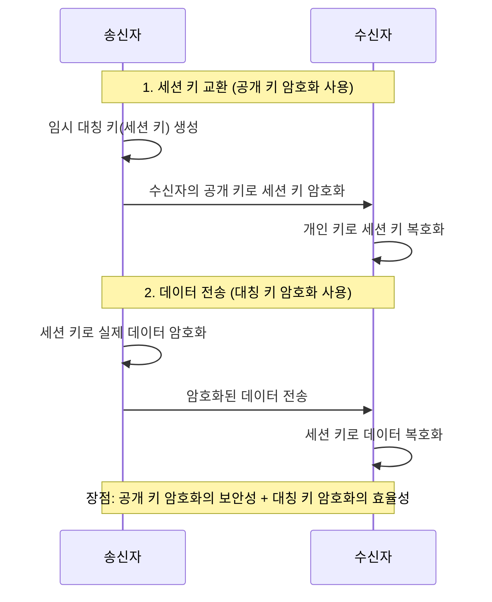
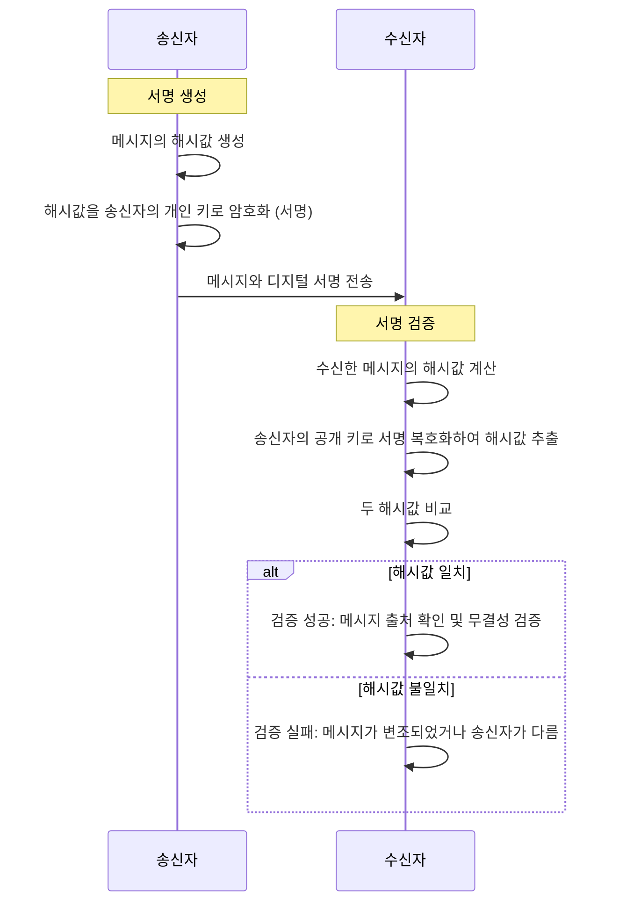
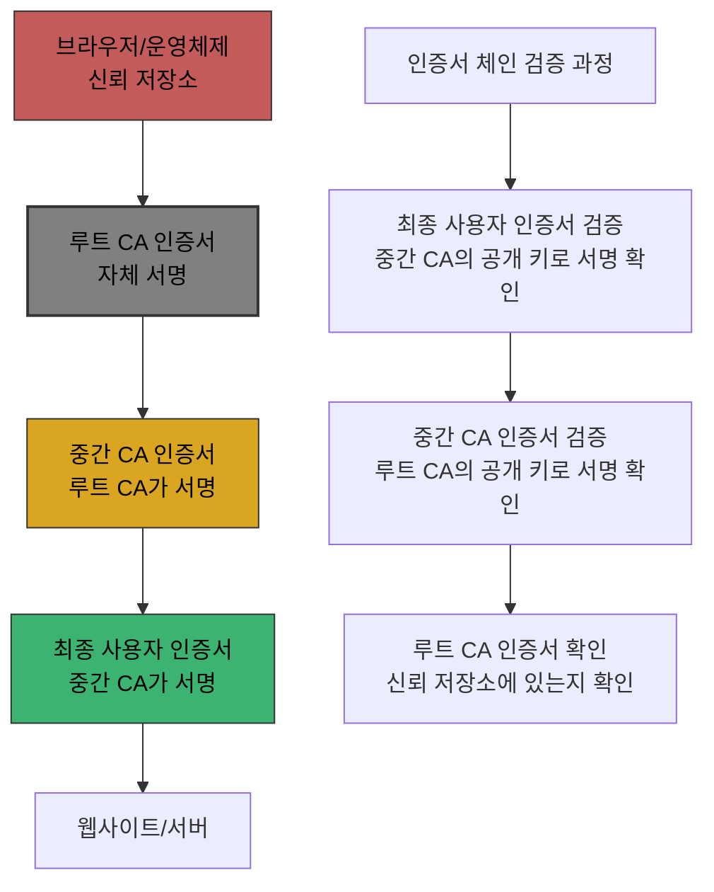
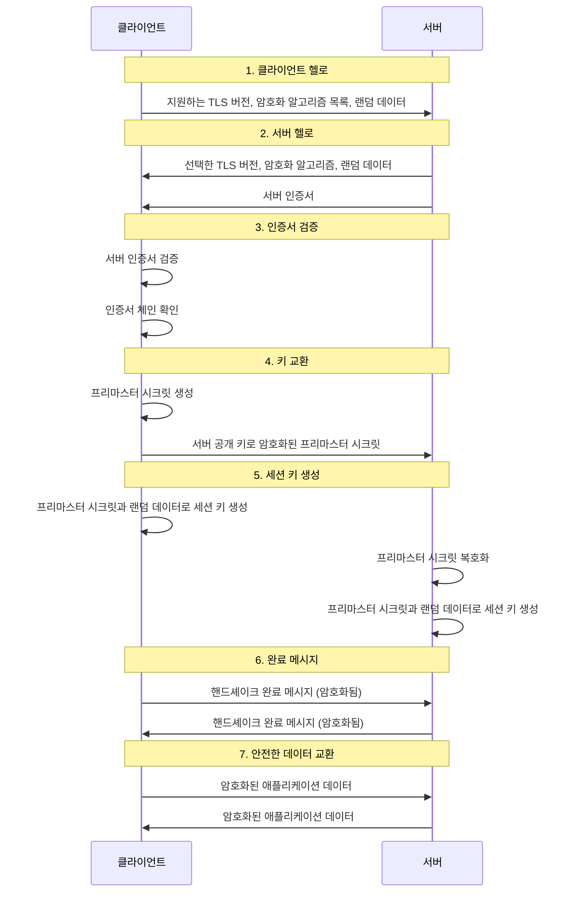

# Chapter 07 네트워크 심화

## 07-2 안전성을 위한 기술

### 개요

이 섹션에서는 네트워크 통신의 안전성을 확보하기 위한 다양한 기술과 개념에 대해 알아봅니다. 인터넷을 통한 데이터 전송은 본질적으로 여러 보안 위협에 노출되어 있습니다. 이러한 위협으로부터 데이터를 보호하기 위해 암호화 기술, 인증서, HTTPS 등의 보안 기술이 필요합니다. 이 장에서는 이러한 기술들의 원리와 작동 방식을 살펴보고, 웹 개발자가 알아야 할 보안 관련 지식을 다루겠습니다.

### 암호와 인증서

암호화(Encryption)는 데이터를 권한이 없는 사용자가 읽을 수 없는 형태로 변환하는 과정입니다. 암호화된 데이터는 적절한 복호화 키를 가진 사용자만이 원래 형태로 복원할 수 있습니다.

#### 대칭 키 암호화 방식과 공개 키 암호화 방식

암호화 방식은 크게 대칭 키 암호화와 공개 키 암호화로 나눌 수 있습니다.

##### 대칭 키 암호화

대칭 키 암호화(Symmetric Key Encryption)는 동일한 키를 사용하여 암호화와 복호화를 수행하는 방식입니다.

- **특징**:
  - 하나의 키로 암호화와 복호화를 모두 수행
  - 계산 효율성이 높고 속도가 빠름
  - 키 배포 문제가 존재 (안전한 키 교환 방법 필요)

- **주요 알고리즘**:
  - DES(Data Encryption Standard): 56비트 키를 사용하는 오래된 알고리즘
  - AES(Advanced Encryption Standard): 128, 192, 256비트 키를 사용하는 현대적 알고리즘
  - 3DES(Triple DES): DES를 세 번 적용하여 보안성을 높인 알고리즘

- **사용 사례**:
  - 대용량 데이터 암호화
  - 세션 키로 사용 (TLS에서 실제 데이터 암호화)
  - 파일 암호화

##### 공개 키 암호화

공개 키 암호화(Public Key Encryption) 또는 비대칭 키 암호화(Asymmetric Key Encryption)는 서로 다른 두 개의 키(공개 키와 개인 키)를 사용하는 방식입니다.

- **특징**:
  - 공개 키로 암호화한 데이터는 개인 키로만 복호화 가능
  - 개인 키로 암호화(서명)한 데이터는 공개 키로 검증 가능
  - 대칭 키 방식보다 계산 비용이 높고 속도가 느림
  - 키 배포 문제 해결 (공개 키는 누구에게나 공개 가능)

- **주요 알고리즘**:
  - RSA: 소인수분해의 어려움을 기반으로 한 알고리즘
  - ECC(Elliptic Curve Cryptography): 타원곡선의 수학적 특성을 활용한 알고리즘
  - Diffie-Hellman: 키 교환 프로토콜

- **사용 사례**:
  - 디지털 서명
  - 키 교환 (대칭 키 암호화를 위한 키 공유)
  - 인증

##### 하이브리드 암호화

실제 많은 시스템에서는 대칭 키와 공개 키 암호화를 함께 사용하는 하이브리드 방식을 채택합니다.

1. 공개 키 암호화로 임시 대칭 키(세션 키)를 안전하게 교환
2. 실제 데이터는 빠른 대칭 키 암호화로 암호화/복호화

이 방식은 공개 키 암호화의 보안성과 대칭 키 암호화의 효율성을 모두 활용할 수 있습니다.

#### 인증서와 디지털 서명

##### 디지털 서명

디지털 서명(Digital Signature)은 메시지의 출처와 무결성을 검증하는 기술입니다.

- **작동 방식**:
  1. 송신자가 메시지의 해시값을 생성
  2. 해시값을 송신자의 개인 키로 암호화 (서명)
  3. 수신자는 송신자의 공개 키로 서명을 복호화하여 해시값을 얻음
  4. 수신자가 메시지로부터 해시값을 계산하여 비교
  5. 두 해시값이 일치하면 메시지가 변조되지 않았고, 실제로 송신자가 보낸 것임을 확인

- **특성**:
  - 인증(Authentication): 메시지가 실제 송신자로부터 왔음을 증명
  - 무결성(Integrity): 메시지가 전송 중에 변조되지 않았음을 보장
  - 부인 방지(Non-repudiation): 송신자가 나중에 메시지 전송 사실을 부인할 수 없음

##### 인증서

디지털 인증서(Digital Certificate)는 공개 키의 소유권을 증명하는 전자 문서입니다. 인증서는 신뢰할 수 있는 제3자인 인증 기관(CA, Certificate Authority)에 의해 발급됩니다.

- **인증서 구성 요소**:
  - 소유자 정보 (이름, 조직, 이메일 등)
  - 소유자의 공개 키
  - 인증서 발급자 정보
  - 유효 기간
  - 디지털 서명 (인증 기관의 개인 키로 서명)
  - 인증서 일련번호
  - 인증서 버전 및 알고리즘 정보

- **인증서 체인**:
  - 루트 인증 기관(Root CA): 자체 서명된 인증서를 가진 최상위 인증 기관
  - 중간 인증 기관(Intermediate CA): 루트 CA에 의해 인증된 기관
  - 최종 사용자 인증서: 웹 서버, 클라이언트 등에 발급된 인증서

- **인증서 검증 과정**:
  1. 인증서의 서명을 발급자의 공개 키로 검증
  2. 인증서가 유효 기간 내인지 확인
  3. 인증서가 해지되지 않았는지 확인 (CRL 또는 OCSP 사용)
  4. 인증서 체인을 따라 루트 CA까지 검증

- **인증서 형식**:
  - X.509: 가장 널리 사용되는 인증서 표준
  - PEM, DER: 인증서 인코딩 형식
  - PKCS#12(.p12, .pfx): 개인 키와 인증서를 함께 저장하는 형식

### HTTPS: SSL과 TLS

HTTPS(Hypertext Transfer Protocol Secure)는 HTTP 통신을 SSL/TLS 프로토콜로 암호화하여 보안을 강화한 프로토콜입니다.

#### SSL과 TLS의 개요

- **SSL(Secure Sockets Layer)**: Netscape에서 개발한 원래의 보안 프로토콜
- **TLS(Transport Layer Security)**: SSL의 후속 버전으로, 현재 표준으로 사용됨
- SSL 3.0 이후 TLS 1.0, 1.1, 1.2, 1.3으로 발전
- 현재는 보안 취약점으로 인해 SSL 2.0, 3.0 및 TLS 1.0, 1.1은 사용이 권장되지 않음

#### TLS 핸드셰이크 과정

TLS 핸드셰이크는 클라이언트와 서버 간에 안전한 연결을 설정하는 과정입니다.

1. **클라이언트 헬로(Client Hello)**:
   - 클라이언트가 지원하는 TLS 버전, 암호화 알고리즘 목록, 랜덤 데이터 전송

2. **서버 헬로(Server Hello)**:
   - 서버가 선택한 TLS 버전, 암호화 알고리즘, 랜덤 데이터 응답
   - 서버 인증서 전송

3. **인증서 검증**:
   - 클라이언트가 서버 인증서 검증
   - 인증서 체인을 통해 신뢰성 확인

4. **키 교환**:
   - 클라이언트가 프리마스터 시크릿(pre-master secret) 생성
   - 서버의 공개 키로 암호화하여 전송

5. **세션 키 생성**:
   - 양측이 프리마스터 시크릿과 교환된 랜덤 데이터를 사용하여 동일한 세션 키 생성

6. **완료 메시지**:
   - 양측이 핸드셰이크 완료 메시지 교환
   - 이후 통신은 협상된 세션 키로 암호화

#### TLS 1.3의 개선사항

TLS 1.3은 2018년에 표준화된 최신 버전으로, 이전 버전에 비해 여러 개선사항이 있습니다.

- **핸드셰이크 단순화**: 1-RTT(Round Trip Time)로 연결 설정 가능 (이전 버전은 2-RTT)
- **0-RTT 재연결**: 이전에 연결했던 서버에 추가 지연 없이 데이터 전송 가능
- **취약한 암호화 알고리즘 제거**: RC4, DES, 3DES, MD5 등 제거
- **전방향 비밀성(Forward Secrecy) 의무화**: 세션 키가 노출되어도 이전 통신 내용 보호
- **디지털 서명 알고리즘 개선**: RSA-PSS, EdDSA 등 추가

#### HTTPS의 이점

- **데이터 기밀성**: 전송 데이터가 암호화되어 도청 방지
- **데이터 무결성**: 전송 중 데이터 변조 감지 가능
- **인증**: 통신 상대의 신원 확인 가능
- **SEO 이점**: 구글 등 검색 엔진이 HTTPS 웹사이트에 더 높은 순위 부여
- **최신 웹 기술 지원**: HTTP/2, PWA 등 최신 웹 기술은 HTTPS 필요

#### HTTPS 구현 시 고려사항

- **인증서 선택**:
  - DV(Domain Validation): 도메인 소유권만 확인
  - OV(Organization Validation): 조직 정보 확인
  - EV(Extended Validation): 가장 엄격한 검증, 주소창에 조직명 표시

- **인증서 관리**:
  - 정기적인 갱신 필요 (일반적으로 1-2년 유효)
  - 개인 키 안전한 보관
  - 인증서 체인 올바른 구성

- **HSTS(HTTP Strict Transport Security)**:
  - 브라우저가 항상 HTTPS로만 사이트에 접속하도록 강제
  - 중간자 공격 방지에 효과적

- **혼합 콘텐츠(Mixed Content) 방지**:
  - HTTPS 페이지 내에서 HTTP 리소스 로드 방지
  - 모든 리소스(이미지, 스크립트, 스타일시트 등)를 HTTPS로 제공

### 8가지 키워드로 정리하는 핵심 포인트

1. **대칭 키 암호화**: 동일한 키로 암호화와 복호화를 수행하는 방식으로, 속도가 빠르지만 안전한 키 교환이 어려운 암호화 기법입니다.
2. **공개 키 암호화**: 공개 키와 개인 키 쌍을 사용하는 비대칭 암호화 방식으로, 키 배포 문제를 해결하고 디지털 서명을 가능하게 하지만 계산 비용이 높은 암호화 기법입니다.
3. **하이브리드 암호화**: 공개 키 암호화로 세션 키를 교환하고 실제 데이터는 대칭 키로 암호화하는 방식으로, 두 암호화 방식의 장점을 결합한 실용적인 접근법입니다.
4. **디지털 서명**: 메시지의 출처와 무결성을 검증하는 기술로, 송신자의 개인 키로 메시지의 해시값을 암호화하여 생성합니다.
5. **인증서**: 공개 키의 소유권을 증명하는 전자 문서로, 신뢰할 수 있는 인증 기관(CA)에 의해 발급되며 웹 보안의 신뢰 체계를 구성합니다.
6. **TLS 핸드셰이크**: 클라이언트와 서버 간에 암호화된 통신 채널을 설정하는 과정으로, 인증서 검증과 세션 키 교환이 이루어집니다.
7. **HTTPS**: HTTP 통신을 SSL/TLS로 암호화한 프로토콜로, 데이터의 기밀성, 무결성, 인증을 제공하여 안전한 웹 통신을 가능하게 합니다.
8. **전방향 비밀성**: 현재 세션 키가 노출되더라도 이전 통신 내용을 보호하는 보안 속성으로, 정기적인 키 갱신을 통해 구현됩니다.

### 확인 문제

1. 다음 중 대칭 키 암호화 방식의 특징이 아닌 것은?
   - [ ] 암호화와 복호화에 동일한 키를 사용한다.
   - [ ] 공개 키 암호화 방식보다 속도가 빠르다.
   - [ ] 키 배포 문제가 없다.
   - [ ] 대용량 데이터 암호화에 적합하다.

2. 디지털 서명의 주요 목적으로 옳지 않은 것은?
   - [ ] 메시지 송신자의 인증
   - [ ] 메시지 무결성 검증
   - [ ] 부인 방지(Non-repudiation)
   - [ ] 메시지 내용의 기밀성 보장

3. TLS 핸드셰이크 과정에서 세션 키를 생성하기 위해 사용되는 것은?
   - [ ] 서버의 개인 키
   - [ ] 클라이언트의 개인 키
   - [ ] 프리마스터 시크릿과 양측이 교환한 랜덤 데이터
   - [ ] 인증서의 일련번호

4. 다음 중 HTTPS의 이점이 아닌 것은?
   - [ ] 전송 데이터의 기밀성 보장
   - [ ] 웹사이트 신원 인증
   - [ ] 서버 성능 향상
   - [ ] 검색 엔진 최적화(SEO) 개선

5. 인증서 체인에 대한 설명으로 옳은 것은?
   - [ ] 모든 웹사이트는 자체 서명된 인증서를 사용해야 한다.
   - [ ] 루트 CA의 인증서는 브라우저나 운영체제에 미리 설치되어 있다.
   - [ ] 인증서 체인은 최대 2개의 인증서로 구성된다.
   - [ ] 중간 인증 기관은 최종 사용자 인증서를 검증할 수 없다.

> [정답 및 해설 보기](../answers_and_explanations.md#07-2-안전성을-위한-기술)
