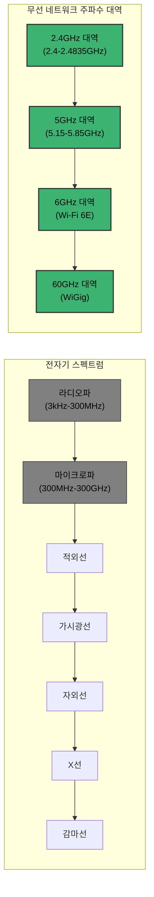
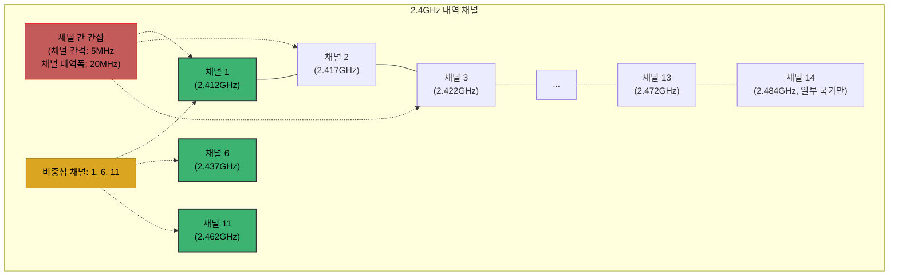
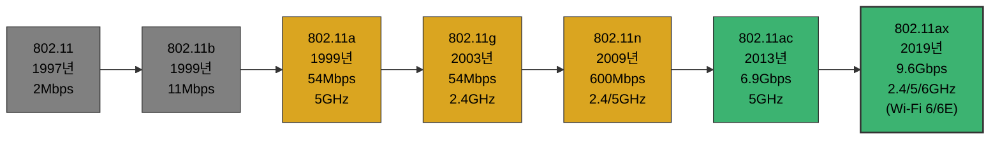
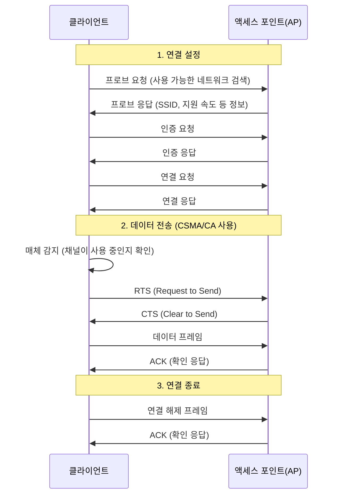
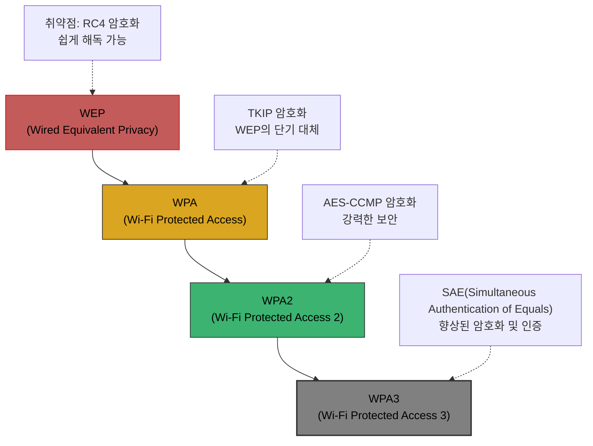
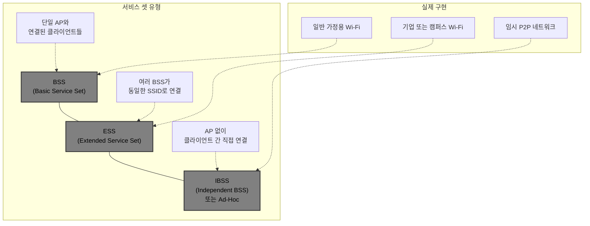
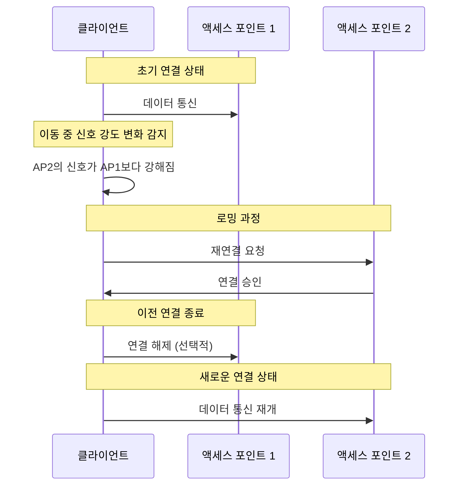
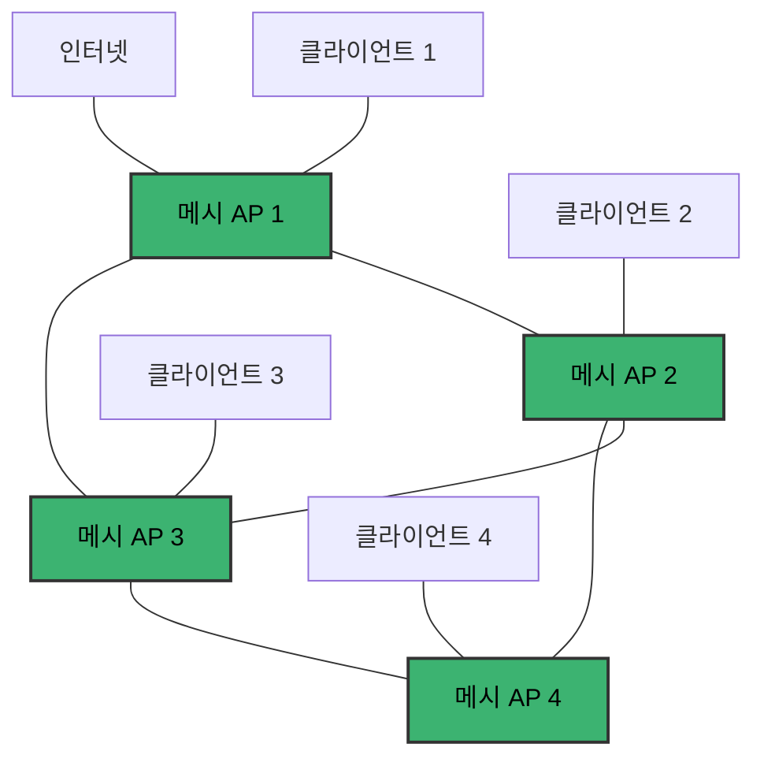

# Chapter 07 네트워크 심화

## 07-3 무선 네트워크

### 개요

이 섹션에서는 현대 네트워크의 중요한 부분을 차지하는 무선 네트워크 기술에 대해 알아봅니다. 유선 네트워크와 달리 물리적 케이블 없이 전파를 통해 데이터를 전송하는 무선 네트워크의 기본 원리, 표준, 구성 요소 및 작동 방식을 살펴보겠습니다. 특히 와이파이(Wi-Fi)를 중심으로 무선 네트워크의 핵심 개념과 기술을 이해하고, 웹 개발자로서 알아두면 유용한 무선 네트워크 관련 지식을 다루겠습니다.

### 전파와 주파수

무선 네트워크는 전파(Radio Waves)를 사용하여 데이터를 전송합니다. 전파는 전자기파의 일종으로, 공기 중을 통해 전파됩니다.

#### 전자기 스펙트럼과 무선 주파수

전자기 스펙트럼은 모든 가능한 주파수의 전자기파를 포함합니다. 무선 통신에 사용되는 주파수 대역은 이 스펙트럼의 일부입니다.

#### 주파수와 채널

무선 네트워크에서 주파수는 채널로 나뉘어 사용됩니다. 각 채널은 특정 주파수 대역을 사용하며, 이를 통해 여러 무선 네트워크가 동시에 운영될 수 있습니다.

#### 주파수 대역의 특성

무선 네트워크에서 사용하는 주요 주파수 대역은 각각 다른 특성을 가지고 있습니다.

- **2.4GHz 대역**:
  - 장점: 장애물 투과성이 좋고, 도달 거리가 상대적으로 김
  - 단점: 많은 기기(전자레인지, 블루투스 등)와 간섭 발생, 채널 수 제한
  - 사용: 대부분의 Wi-Fi 라우터, 블루투스, 많은 IoT 기기

- **5GHz 대역**:
  - 장점: 더 많은 채널 사용 가능, 간섭이 적음, 더 높은 대역폭
  - 단점: 장애물 투과성이 낮고, 도달 거리가 짧음
  - 사용: 최신 Wi-Fi 라우터(듀얼 밴드), 고성능 무선 기기

- **6GHz 대역 (Wi-Fi 6E)**:
  - 장점: 매우 넓은 추가 스펙트럼, 간섭 최소화
  - 단점: 도달 거리가 더 짧음, 호환 기기 제한
  - 사용: 최신 고성능 Wi-Fi 6E 지원 기기

### 와이파이와 802.11

와이파이(Wi-Fi)는 IEEE 802.11 표준을 기반으로 하는 무선 네트워크 기술입니다. 이 표준은 무선 LAN(WLAN)의 구현 방법을 정의합니다.

#### IEEE 802.11 표준의 발전

IEEE 802.11 표준은 시간이 지남에 따라 계속 발전해왔으며, 각 버전마다 속도와 기능이 향상되었습니다.

#### 주요 802.11 표준 비교

| 표준 | 상업명 | 주파수 대역 | 최대 속도 | 특징 |
|------|--------|------------|-----------|------|
| 802.11b | Wi-Fi 1 | 2.4GHz | 11Mbps | 초기 대중화 표준 |
| 802.11a | Wi-Fi 2 | 5GHz | 54Mbps | 높은 속도, 짧은 범위 |
| 802.11g | Wi-Fi 3 | 2.4GHz | 54Mbps | 널리 사용됨, b와 호환 |
| 802.11n | Wi-Fi 4 | 2.4/5GHz | 600Mbps | MIMO 기술 도입 |
| 802.11ac | Wi-Fi 5 | 5GHz | 6.9Gbps | MU-MIMO, 넓은 채널 |
| 802.11ax | Wi-Fi 6/6E | 2.4/5/6GHz | 9.6Gbps | OFDMA, 효율성 향상 |

#### 와이파이 작동 원리

와이파이는 다음과 같은 기본 원리로 작동합니다.

#### CSMA/CA

무선 네트워크에서는 유선 이더넷의 CSMA/CD 대신 CSMA/CA(Carrier Sense Multiple Access with Collision Avoidance)를 사용합니다.

- **작동 방식**:
  1. 전송 전 매체 감지: 채널이 사용 중인지 확인
  2. 백오프 알고리즘: 채널이 사용 중이면 무작위 시간 동안 대기
  3. RTS/CTS(선택적): 숨겨진 노드 문제 해결을 위한 메커니즘
  4. 데이터 전송 및 ACK: 데이터 전송 후 확인 응답 대기

- **CSMA/CD와의 차이점**:
  - CSMA/CD: 충돌 감지(Collision Detection) - 유선 환경에서 사용
  - CSMA/CA: 충돌 회피(Collision Avoidance) - 무선 환경에서 사용

#### 와이파이 보안

와이파이 네트워크의 보안은 시간이 지남에 따라 크게 발전했습니다.

- **WEP**: 초기 보안 프로토콜, 심각한 취약점으로 현재 사용 권장되지 않음
- **WPA**: WEP의 취약점 해결을 위한 임시 표준, TKIP 사용
- **WPA2**: 현재 가장 널리 사용되는 표준, AES-CCMP 암호화 사용
- **WPA3**: 최신 보안 표준, 향상된 암호화 및 인증 메커니즘 제공

### AP와 서비스 셋

액세스 포인트(AP)는 무선 클라이언트와 유선 네트워크 사이의 연결을 제공하는 장치입니다. 서비스 셋은 무선 네트워크의 구성 방식을 나타냅니다.

#### 액세스 포인트(AP)의 역할

액세스 포인트는 다음과 같은 주요 기능을 수행합니다:

1. 무선 클라이언트와 유선 네트워크 간의 브리지 역할
2. SSID(Service Set Identifier) 브로드캐스트
3. 무선 클라이언트의 인증 및 연결 관리
4. 무선 신호의 송수신 및 관리
5. 채널 및 주파수 관리

#### 서비스 셋 유형

무선 네트워크는 구성 방식에 따라 여러 유형의 서비스 셋으로 분류됩니다.

##### BSS (Basic Service Set)

BSS는 하나의 AP와 이에 연결된 여러 클라이언트로 구성된 기본 네트워크 단위입니다.

- **특징**:
  - 하나의 AP가 중앙 연결 지점 역할
  - 모든 통신은 AP를 통해 이루어짐
  - 고유한 BSSID(일반적으로 AP의 MAC 주소)로 식별

##### ESS (Extended Service Set)

ESS는 여러 BSS가 동일한 SSID로 연결된 더 큰 네트워크입니다.

- **특징**:
  - 여러 AP가 동일한 네트워크를 제공
  - 로밍(Roaming) 지원: 클라이언트가 AP 간 이동 가능
  - 분산 시스템(DS)으로 AP들이 연결됨
  - 넓은 지역 커버리지 제공

##### IBSS (Independent Basic Service Set)

IBSS는 AP 없이 클라이언트 간 직접 연결되는 네트워크입니다(Ad-Hoc 네트워크라고도 함).

- **특징**:
  - AP 불필요
  - 클라이언트 간 직접 통신
  - 임시 네트워크에 적합
  - 제한된 범위와 기능

#### 로밍(Roaming)

로밍은 무선 클라이언트가 하나의 AP에서 다른 AP로 이동할 때 연결을 유지하는 과정입니다.

- **로밍 결정 요소**:
  - 신호 강도(RSSI)
  - 신호 품질
  - 채널 사용률
  - AP 부하

- **로밍 유형**:
  - 기본 로밍: 클라이언트 주도 로밍
  - 빠른 로밍: 802.11r 표준 기반, 인증 과정 최적화
  - 원활한 로밍: 기업 환경에서 컨트롤러 기반 로밍

#### 메시 네트워크

메시 네트워크는 여러 AP가 서로 연결되어 더 넓은 커버리지와 안정성을 제공하는 고급 무선 네트워크 구성입니다.

- **특징**:
  - AP 간 무선 연결로 네트워크 확장
  - 자동 경로 설정 및 자가 복구 기능
  - 단일 장애점 제거로 안정성 향상
  - 설치 및 확장이 용이

- **사용 사례**:
  - 넓은 가정이나 사무실
  - 다층 건물
  - 실외 커버리지가 필요한 환경
  - 케이블 설치가 어려운 지역

### 9가지 키워드로 정리하는 핵심 포인트

1. **전파와 주파수**: 무선 네트워크는 전자기파의 일종인 전파를 사용하여 데이터를 전송하며, 2.4GHz, 5GHz, 6GHz 등 다양한 주파수 대역을 활용합니다.
2. **채널**: 무선 주파수 대역은 여러 채널로 나뉘어 사용되며, 채널 간 간섭을 최소화하기 위해 비중첩 채널(2.4GHz에서는 1, 6, 11)을 사용하는 것이 중요합니다.
3. **IEEE 802.11**: 와이파이의 기술적 기반이 되는 표준으로, 802.11a/b/g/n/ac/ax 등 다양한 버전이 있으며 각각 속도와 기능이 향상되었습니다.
4. **CSMA/CA**: 무선 네트워크에서 충돌을 회피하기 위한 매체 접근 제어 방식으로, 전송 전 매체 감지와 백오프 알고리즘을 사용합니다.
5. **액세스 포인트(AP)**: 무선 클라이언트와 유선 네트워크 사이의 연결을 제공하는 장치로, SSID 브로드캐스트, 인증, 연결 관리 등의 기능을 수행합니다.
6. **서비스 셋**: 무선 네트워크의 구성 방식을 나타내며, BSS(단일 AP), ESS(여러 AP), IBSS(Ad-Hoc) 등의 유형이 있습니다.
7. **로밍**: 무선 클라이언트가 하나의 AP에서 다른 AP로 이동할 때 연결을 유지하는 과정으로, 신호 강도, 품질 등을 기반으로 결정됩니다.
8. **와이파이 보안**: WEP, WPA, WPA2, WPA3 등 다양한 보안 프로토콜이 발전해왔으며, 현재는 WPA2/WPA3가 권장됩니다.
9. **메시 네트워크**: 여러 AP가 서로 연결되어 더 넓은 커버리지와 안정성을 제공하는 고급 무선 네트워크 구성으로, 자동 경로 설정 및 자가 복구 기능을 제공합니다.

### 확인 문제

1. 다음 중 2.4GHz 대역의 특성으로 옳지 않은 것은?
   - [ ] 장애물 투과성이 5GHz보다 좋다.
   - [ ] 도달 거리가 5GHz보다 길다.
   - [ ] 블루투스와 같은 다른 기기와 간섭이 발생할 수 있다.
   - [x] 사용 가능한 채널 수가 5GHz보다 많다.

2. 다음 중 무선 네트워크에서 주파수 대역이 높아질수록 나타나는 특성은?
   - [ ] 장애물 투과성이 좋아진다
   - [ ] 도달 거리가 길어진다
   - [x] 더 많은 채널을 사용할 수 있다
   - [ ] 다른 기기와의 간섭이 증가한다

3. 무선 네트워크에서 사용하는 매체 접근 제어 방식은?
   - [ ] CSMA/CD
   - [x] CSMA/CA
   - [ ] Token Ring
   - [ ] TDMA

4. 다음 중 와이파이 보안 프로토콜을 시간순으로 올바르게 나열한 것은?
   - [x] WEP → WPA → WPA2 → WPA3
   - [ ] WPA → WEP → WPA2 → WPA3
   - [ ] WPA → WPA2 → WEP → WPA3
   - [ ] WEP → WPA2 → WPA → WPA3

5. 여러 AP가 동일한 SSID로 연결된 무선 네트워크 구성을 무엇이라고 하는가?
   - [ ] BSS (Basic Service Set)
   - [x] ESS (Extended Service Set)
   - [ ] IBSS (Independent Basic Service Set)
   - [ ] MSS (Multiple Service Set)

6. 무선 클라이언트가 하나의 AP에서 다른 AP로 이동할 때 연결을 유지하는 과정을 무엇이라고 하는가?
   - [x] 로밍(Roaming)
   - [ ] 핸드오버(Handover)
   - [ ] 스위칭(Switching)
   - [ ] 브리징(Bridging)

7. 다음 중 메시 네트워크의 특징이 아닌 것은?
   - [ ] AP 간 무선 연결로 네트워크 확장
   - [ ] 자동 경로 설정 및 자가 복구 기능
   - [x] 모든 통신이 중앙 컨트롤러를 통해 이루어짐
   - [ ] 단일 장애점 제거로 안정성 향상

8. 무선 네트워크에서 비중첩 채널(non-overlapping channels)을 사용하는 주된 이유는?
   - [ ] 전송 속도를 높이기 위해
   - [x] 채널 간 간섭을 최소화하기 위해
   - [ ] 보안성을 강화하기 위해
   - [ ] 전력 소비를 줄이기 위해

9. 다음 중 와이파이 네트워크의 식별자로 사용되는 것은?
   - [x] SSID
   - [ ] MAC
   - [ ] IP
   - [ ] DNS

> [정답 및 해설 보기](../answers_and_explanations.md#07-3-무선-네트워크)
